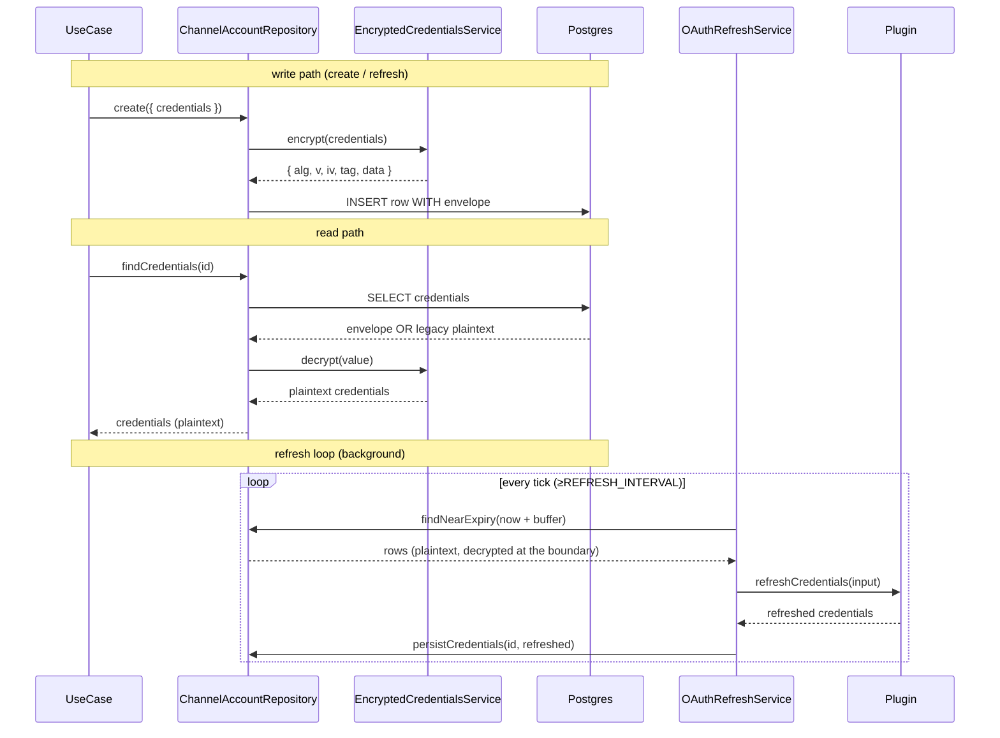

# Feature 030 — Design

**Spec**: `.specs/features/030-oauth-credential-primitives/spec.md`
**Status**: Approved

---

## Architecture Overview

The slice ships three independent primitives that compose around the existing
`credentials: jsonb` columns:

1. A **zod mixin** in `@kizunu/api-contracts/shared` (`oauthCredentialFields`)
   that any plugin/connector schema can spread into its own object.
2. An **`EncryptedCredentialsService`** colocated with the persistence services
   in `@kizunu/nestjs-shared/modules/persistence/`. AES-256-GCM, single key,
   envelope discriminated by `alg`, plaintext-fallback on read (backward
   compat). Used by `ChannelAccountRepository` and `ConnectorAccountRepository`
   at every `credentials` boundary.
3. An **`OAuthRefreshService`** in `apps/api/src/modules/channel/core/` plus
   an optional `ChannelPlugin.refreshCredentials?` hook. The service is the
   only place that talks to provider refresh endpoints (via the hook); the rest
   of the engine reads `credentials` like any other row.



---

## Code Reuse Analysis

### Existing Components to Leverage

| Component                                | Location                                                                                  | How to Use                                                                                                                                                       |
| ---------------------------------------- | ----------------------------------------------------------------------------------------- | ---------------------------------------------------------------------------------------------------------------------------------------------------------------- |
| `DrizzleService`                         | `packages/nestjs-shared/src/modules/persistence/services/drizzle.service.ts`              | Repositories continue to use it; the encryption boundary sits between repo and Drizzle.                                                                          |
| `ChannelPlugin` port (D2)                | `apps/api/src/modules/channel/core/plugin/channel-plugin.ts`                              | Add optional `refreshCredentials?(input)` hook mirroring the `onAccountCreated` pattern from 029.                                                                |
| `OnAccountCreatedInput` shape            | `apps/api/src/modules/channel/core/plugin/on-account-created-input.ts`                    | Mirror the same shape for `RefreshCredentialsInput` so future plugins see a familiar pair of hooks.                                                              |
| `ApplicationException` envelope          | `@kizunu/nestjs-shared/lib/exceptions/application.exception`                              | A new `CredentialsDecryptionFailedException(500, 'channel.credentials-decryption-failed')` for tamper/garbage cases.                                            |
| `JourneyPoller` pattern                  | `apps/api/src/modules/engine/core/services/journey-poller.ts` (D5)                        | Same `setInterval` + `NODE_ENV=test` guard pattern for the OAuth refresh poller.                                                                                 |
| `zod` `.extend()` composition            | `metaCredentialsSchema` in `meta-credentials.ts`                                          | `metaCredentialsSchema.extend(oauthCredentialFields)` is the canonical shape for a Coex-mode credential set in 031.                                              |
| `Config` config schema                   | `apps/api/src/api.config.ts`                                                              | Add `credentials: { encryptionKey: string }` (base64, 32 raw bytes after decode).                                                                                |

### Integration Points

| System                                     | Integration Method                                                                                                                                                                                                                                                       |
| ------------------------------------------ | -------------------------------------------------------------------------------------------------------------------------------------------------------------------------------------------------------------------------------------------------------------------------- |
| `node:crypto`                              | The encryption service uses `createCipheriv('aes-256-gcm', key, iv)` / `createDecipheriv(...)`. IV is 12 random bytes per encrypt; auth tag is 16 bytes; both stored on the envelope as base64.                                                                          |
| `ChannelAccountRepository` (029) read+write | Repo `create({ credentials })` calls `encrypt(credentials)` before insert; `findCredentials` / `findWorkspaceAndCredentials` / `listByWorkspace` (where applicable — `listByWorkspace` doesn't expose `credentials`) call `decrypt(value)` after select.                |
| `ConnectorAccountRepository` (004) read+write | Same shape — `create({ credentials })` encrypts before insert; `findById` / `findByConnectorInWorkspace` decrypt after select. `findByIdInWorkspace` only returns `{ id }` so it's untouched.                                                                          |
| Web channel-account form (029)             | Unchanged. The encryption is invisible above the repo boundary; the form's `useCreateChannelAccount` continues to post plaintext over HTTPS.                                                                                                                              |

---

## Components

### `oauthCredentialFields` (zod mixin)

- **Purpose**: A reusable zod object shape that any plugin/connector schema can
  spread into its own credentials object: `accessToken: z.string().min(1)`,
  `refreshToken: z.string().min(1).optional()`,
  `accessTokenExpiresAt: z.iso.datetime().optional()` (with a `.transform(d => new Date(d))`
  output) — though `z.iso.datetime()` already gives a `Date` after `.pipe(z.date())`
  if needed; the shape is operator-facing so we keep it ISO on the wire and apply
  the transform at read-time in `OAuthRefreshService.findNearExpiry`.
- **Location**: `packages/api-contracts/src/shared/oauth-credential-fields.ts`
  (new `shared/` sub-dir for cross-domain primitives).
- **Interfaces**:
  - `export const oauthCredentialFields = { accessToken, refreshToken, accessTokenExpiresAt } satisfies z.ZodRawShape`
  - `export type OAuthCredentialFields = z.infer<z.ZodObject<typeof oauthCredentialFields>>`
- **Dependencies**: `zod`.
- **Reuses**: zod top-level v4 helpers per the project convention.

### `EncryptedCredentialsService`

- **Purpose**: AES-256-GCM round-trip at the persistence boundary, with a
  plaintext-passthrough on read for legacy rows.
- **Location**: `packages/nestjs-shared/src/modules/persistence/services/encrypted-credentials.service.ts`.
- **Interfaces**:
  - `encrypt(value: unknown): EncryptedCredentialsEnvelope` — throws if value is `undefined`.
  - `decrypt(value: unknown): unknown` — returns the input unchanged when it is NOT an envelope
    (backward-compat); throws `CredentialsDecryptionFailedException` on a tampered envelope.
  - `isEnvelope(value: unknown): value is EncryptedCredentialsEnvelope` — narrowing helper used
    internally and by the repos' integration tests.
- **Dependencies**: `node:crypto` (`createCipheriv`, `createDecipheriv`, `randomBytes`); the
  encryption key injected via `ConfigService<Config>`.
- **Reuses**: nothing else — single-purpose service.

### `EncryptedCredentialsEnvelope` (type)

- **Purpose**: The on-disk shape of an encrypted credential blob.
- **Location**: `packages/nestjs-shared/src/modules/persistence/services/encrypted-credentials-envelope.ts`.
- **Interfaces**: `{ alg: 'aes-256-gcm'; v: 1; iv: string; tag: string; data: string }` — all base64.
- **Dependencies**: none.
- **Reuses**: stored as JSONB on existing `credentials` columns, no schema migration.

### `CredentialsDecryptionFailedException`

- **Purpose**: Surfaces a 500 with code `credentials.decryption-failed` when an envelope
  fails auth-tag verification — never silently returns garbage.
- **Location**: `packages/nestjs-shared/src/lib/exceptions/credentials-decryption-failed.exception.ts`
  (colocated with `ApplicationException`).
- **Interfaces**: `new CredentialsDecryptionFailedException()` — no context (the message is
  about an at-rest invariant, not a user input).
- **Dependencies**: `ApplicationException`.

### `ChannelPlugin.refreshCredentials?` (port hook)

- **Purpose**: Optional plugin extension for OAuth-using providers; mirrors `onAccountCreated`.
- **Location**: `apps/api/src/modules/channel/core/plugin/channel-plugin.ts` (signature on the
  interface) + `apps/api/src/modules/channel/core/plugin/refresh-credentials-input.ts` (new file
  for the input type, one-type-per-file).
- **Interfaces**:
  - `refreshCredentials?(input: RefreshCredentialsInput): Promise<unknown>`
  - `RefreshCredentialsInput = { channelAccountId: string; credentials: unknown }`
- **Dependencies**: existing port file structure.
- **Reuses**: same shape as `OnAccountCreatedInput` (less `appUrl` — refresh is server-to-server).

### `ChannelAccountRepository` (refactor)

- **Purpose**: Encrypt on every write path, decrypt on every read path that exposes `credentials`.
  Plus a new `findNearExpiry(now: Date, bufferMs: number): Promise<NearExpiryAccount[]>` used by
  the refresh service.
- **Location**: `apps/api/src/modules/channel/persistence/channel-account.repository.ts`.
- **Interfaces**:
  - `create({ id?, ..., credentials })` — encrypts `credentials` before insert (unchanged signature).
  - `findCredentials(id)` — decrypts the returned row's `credentials`.
  - `findWorkspaceAndCredentials(id)` — decrypts.
  - `findNearExpiry(now, bufferMs)` — `SELECT id, pluginId, credentials FROM channel_accounts
    WHERE (credentials -> 'data') IS NOT NULL OR (credentials -> 'accessTokenExpiresAt') IS NOT NULL`
    — i.e., we decrypt every row whose envelope OR legacy plaintext exposes an
    `accessTokenExpiresAt`, then filter in JS to those within the buffer. The SQL filter is
    intentionally permissive because the encrypted envelope hides the actual expiry timestamp
    from the database. (For pilot volume — single-digit channels — this is fine; high-volume
    deploys would either denormalize `accessTokenExpiresAt` into its own column or store the
    envelope alongside it.)
  - `persistCredentials(id, credentials)` — small new write helper used by the refresh service.
    Encrypts before update.
- **Dependencies**: `EncryptedCredentialsService` injected.
- **Reuses**: existing Drizzle helpers; the encryption boundary is the only change.

### `ConnectorAccountRepository` (refactor)

- **Purpose**: Same boundary as `ChannelAccountRepository`. No refresh hook on CRM
  connectors in this slice (deferred until the second OAuth CRM lands), so no
  `findNearExpiry` / `persistCredentials` extension here.
- **Location**: `apps/api/src/modules/crm/persistence/connector-account.repository.ts`.
- **Interfaces**: `create`, `findById`, `findByConnectorInWorkspace` — all encrypt-on-write,
  decrypt-on-read; signatures unchanged.
- **Dependencies**: `EncryptedCredentialsService`.

### `OAuthRefreshService`

- **Purpose**: Poll the channel-accounts table for near-expiry tokens, dispatch the plugin's
  `refreshCredentials` hook, and persist the refreshed credentials.
- **Location**: `apps/api/src/modules/channel/core/services/oauth-refresh.service.ts`.
- **Interfaces**:
  - `refreshDue(): Promise<{ refreshed: number; failed: number }>` — does one pass.
  - `start(): void` — installs the `setInterval` (no-op if `NODE_ENV === 'test'`).
  - `onModuleInit()` calls `start()`; `onModuleDestroy()` clears the interval.
- **Dependencies**: `ChannelAccountRepository`, `ChannelPluginRegistry`, `Clock` (project's
  injectable clock — see existing usage in dispatcher), a Nest `Logger`.
- **Reuses**: `JourneyPoller` pattern (D5) — same in-process cron model.

### Config additions

- **Purpose**: Carry the encryption key from env to runtime.
- **Location**: `apps/api/src/api.config.ts` + `apps/api/.env.example` + `deploy/docker-compose.yml`.
- **Interfaces**:
  - `credentials.encryptionKey: z.string().min(KEY_BASE64_MIN_LENGTH)` — a 32-byte base64 (44 chars w/ padding).
  - Loaded from `APP_CREDENTIALS_ENCRYPTION_KEY`.
- **Dependencies**: existing config schema and loader.

---

## Data Models (if applicable)

### `EncryptedCredentialsEnvelope`

```typescript
export interface EncryptedCredentialsEnvelope {
  alg: 'aes-256-gcm'
  v: 1
  iv: string   // base64, 12 bytes
  tag: string  // base64, 16 bytes (GCM auth tag)
  data: string // base64, ciphertext of JSON.stringify(plaintext)
}
```

**Storage**: serialized into the same `jsonb` column as before — Postgres
treats it as opaque JSON.

**Backward-compat**: a value lacking `alg` (or where `alg !== 'aes-256-gcm'`)
is treated as legacy plaintext on the read path and returned unchanged. The
write path always emits envelopes.

### `OAuthCredentialFields` (mixin output type)

```typescript
const oauthCredentialFields = {
  accessToken: z.string().min(1),
  refreshToken: z.string().min(1).optional(),
  accessTokenExpiresAt: z.iso.datetime().optional(),
} satisfies z.ZodRawShape
```

**Consumer**: a plugin schema spreads it: `z.object({ ...metaBase, ...oauthCredentialFields }).strict()`.

---

## Error Handling Strategy

| Error Scenario                                            | Handling                                                                                       | User Impact                                                                                |
| --------------------------------------------------------- | ---------------------------------------------------------------------------------------------- | ------------------------------------------------------------------------------------------ |
| Encryption key missing/short at boot                      | Config schema rejects → throw at `load()` → boot fails                                          | Operator sees the env-var error message before the API binds a port.                      |
| Tampered ciphertext (auth tag verify fails)               | `decrypt(...)` throws `CredentialsDecryptionFailedException`; bubbles as 500                    | The affected use-case responds 500; operator inspects the row.                              |
| Refresh hook throws                                       | `OAuthRefreshService` logs the channel-account id + error; row is left unchanged; next tick retries | Send paths continue using the still-valid (just-pre-expiry) token until refresh succeeds. |
| Refresh hook returns a value that doesn't match the schema | Persistence layer encrypts it as-is — the plugin owns the contract                              | The next `send` will fail to parse against the plugin's schema; surfaces upstream.        |
| Plaintext-shaped row read after 030 lands                  | Repo returns it unchanged (backward-compat); next write through the repo encrypts it            | Invisible; lazy migration.                                                                  |

---

## Tech Decisions (only non-obvious ones)

| Decision                                                              | Choice                                                                                                          | Rationale                                                                                                                                                                                                                                                              |
| --------------------------------------------------------------------- | --------------------------------------------------------------------------------------------------------------- | ---------------------------------------------------------------------------------------------------------------------------------------------------------------------------------------------------------------------------------------------------------------------- |
| Where the encryption service lives                                    | `@kizunu/nestjs-shared/modules/persistence/`                                                                    | The service is general-purpose at-rest crypto for credential-shaped jsonb. Both `apps/api` modules (channel + crm) consume it; sibling to `DrizzleService` keeps the persistence-related primitives together.                                                          |
| Where the OAuth mixin lives                                           | `@kizunu/api-contracts/shared/`                                                                                 | Shape is shared by API + web (Coex web form in 031 will render the operator-facing flow); already imported across packages.                                                                                                                                            |
| Where the refresh service lives                                       | `apps/api/src/modules/channel/core/services/`                                                                   | The poller is channel-scoped (the hook is `ChannelPlugin.refreshCredentials`). CRM connector refresh ships when the first OAuth CRM lands — a parallel `CrmConnectorRefreshService` then.                                                                              |
| Encryption algorithm + key length                                     | AES-256-GCM, 256-bit key from env (base64-encoded)                                                              | Industry standard authenticated encryption; node:crypto natively supports it. GCM gives confidentiality + integrity in one step (no separate HMAC).                                                                                                                  |
| IV per encrypt                                                        | 12 random bytes (96 bits) via `randomBytes`                                                                     | NIST-recommended size for GCM. Random vs counter avoids state.                                                                                                                                                                                                         |
| Envelope discriminator                                                | `alg: 'aes-256-gcm'` + `v: 1`                                                                                   | `alg` is the runtime discriminator; `v` reserves room for key-version / alg-rotation without breaking existing rows.                                                                                                                                                   |
| Backward-compat (plaintext rows)                                       | Read passthrough when no `alg`                                                                                  | Avoids a hard cutover. Pre-030 rows continue to read; new writes encrypt. A one-shot re-encrypt script can land later.                                                                                                                                                 |
| `findNearExpiry` SQL filter                                            | Permissive SQL → JS filter on decrypted `accessTokenExpiresAt`                                                  | The envelope hides the expiry timestamp from the database. For pilot volume this is fine. Denormalizing `accessTokenExpiresAt` to a top-level column is the next-step optimization, deferred.                                                                          |
| Refresh-on-demand vs background scheduler                              | **Background scheduler.** On-demand refresh inside `send` would force every send path to know about expiry.    | Use-cases continue to read plaintext credentials and call provider APIs; the lifecycle stays out of their concern. Same posture as the dispatcher poller (D5).                                                                                                       |
| Where the refresh hook lives                                          | On `ChannelPlugin` (alongside `onAccountCreated`)                                                                | Mirrors the existing post-create hook pattern; keeps provider lifecycle inside the plugin module per D2 ("Meta peculiarities live inside the plugin").                                                                                                                |

---

## Risks & Mitigations

| Risk                                                                                                                          | Mitigation                                                                                                                                                                                                            |
| ----------------------------------------------------------------------------------------------------------------------------- | --------------------------------------------------------------------------------------------------------------------------------------------------------------------------------------------------------------------- |
| Operator boots without setting `APP_CREDENTIALS_ENCRYPTION_KEY`                                                               | Config schema requires the value (no default). Boot fails with a clear error message.                                                                                                                                  |
| Operator rotates the key, all encrypted rows become unreadable                                                                | v0.1 has no rotation. The envelope's `v: 1` reserves room for a multi-key reader later; documented as a follow-up in this design.                                                                                      |
| `findNearExpiry` decrypts every channel-account row on every tick                                                              | Pilot volume keeps row count low; index on `pluginId` lets us pre-filter by plugins that declare `refreshCredentials`. The bigger optimization is a denormalized `accessTokenExpiresAt` column; deferred.              |
| Encryption boundary applied to channel-account but missed on a sibling repo write path                                        | Repo-method-by-repo-method audit in tasks; integration spec inspects raw JSONB to assert envelope shape on every write path.                                                                                          |
| `EncryptedCredentialsService` injection forces every persistence consumer to depend on Nest DI                                 | The service is `@Injectable` and exported by the `PersistenceModule` (existing); both `ChannelModule` and `CrmModule` already depend on `PersistenceModule` for `DrizzleService`.                                    |

---

## Tips

- Use `Buffer.from(b64, 'base64')` / `.toString('base64')` for the envelope
  fields — don't reinvent base64.
- Use `JSON.stringify` / `JSON.parse` for plaintext serialization. The cipher
  works on bytes; the JSON layer makes round-tripping plain JSON values exact.
- For integration tests, prefer real Postgres via `db.execute(sql.raw(...))`
  to assert on-disk shape; do not stub Drizzle. The encryption boundary's
  whole point is the at-rest invariant.
- The `OAuthRefreshService` should be exercised with a fake plugin in unit
  tests (no real OAuth round-trip) — the boundary is the plugin's hook, not
  the provider.
