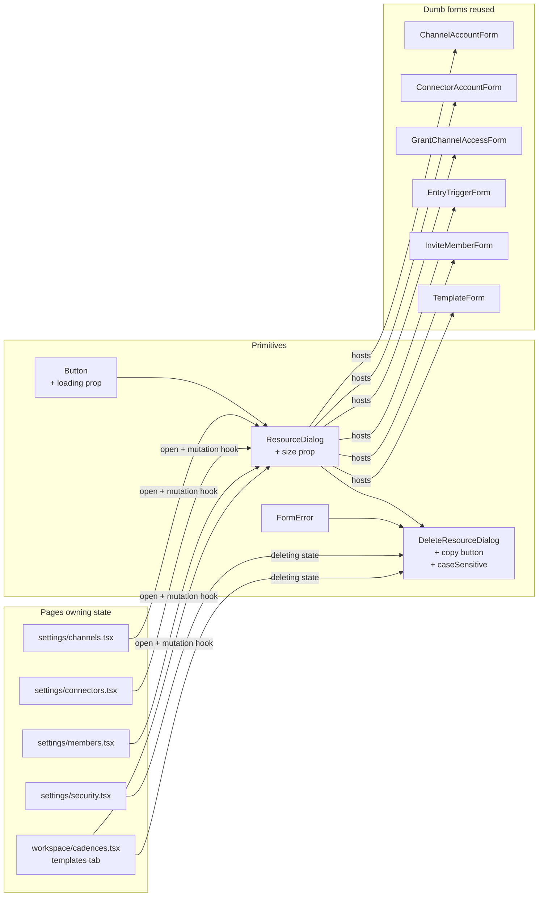

# 044 — Resource Dialog Migration Design

**Spec**: `.specs/features/044-resource-dialog-migration/spec.md`
**Status**: Draft → Approved during Execute kick-off.

---

## Architecture Overview

The migration is a **two-tier change**: enhance two primitives + one
shadcn primitive, then drive every CRUD call-site under
`apps/web/src/routes/_app/{settings,workspace}/**` through them. There
is no new API contract, no new data model, and no new mutation hook —
the api-client is already domain-named (feature 043) and invalidation is
already hook-owned (audited in 043). The only flow that changes is
**user → UI surface**.



The page is the **smart layer** (open state, mutation hook,
side-effects); the form is the **dumb layer** (props in, JSX out) —
exactly per `web-patterns.md` §3.

---

## Code Reuse Analysis

### Existing components to leverage

| Component | Location | How to use |
| --------- | -------- | ---------- |
| `Button` | `apps/web/src/components/primitives/button.tsx` | Add `loading?: boolean` prop (additive); render Phosphor `Spinner` with `animate-spin` when truthy. |
| `ResourceDialog` | `apps/web/src/components/composed/resource-dialog.tsx` | Add `size?: 'md' \| 'lg'` prop (additive, default `'md'`). Replace the inline `?'Working…':actionLabel` text on the action `Button` with the new `loading={isPending}` prop. |
| `DeleteResourceDialog` | `apps/web/src/components/composed/delete-resource-dialog.tsx` | Add `caseSensitive?: boolean` (additive, default `false`). Render the resource-name copy button (Phosphor `Copy` ↔ `Check` flip with `navigator.clipboard.writeText` + 1500ms revert). |
| `FormError` | `apps/web/src/components/composed/form-error.tsx` | Unchanged — used inside dialog bodies. |
| `Dialog` (base shadcn) | `apps/web/src/components/primitives/dialog.tsx` | Unchanged. |
| `PageHeader` actions slot | `apps/web/src/components/composed/page-header.tsx` | Hosts the primary "Create X" button on each migrated settings page. |
| `DropdownMenu` primitive | `apps/web/src/components/primitives/dropdown-menu.tsx` | Hosts per-row action items (Delete, Deactivate, etc.). Already used by Members table; reuse pattern. |
| `getApiErrorMessage` | `apps/web/src/lib/get-api-error-message.ts` | Unchanged — every page maps mutation `onError` through it before setting the dialog's `errorMessage`. |
| `Phosphor` icons | `@phosphor-icons/react` | `Spinner` (loading; already used in `sonner.tsx`), `Copy` + `Check` (copy button), `Trash` / `TrashSimple` (destructive row action), `Plus` (primary create). |
| Mutation hooks | `packages/api-client/src/**/use-*.ts` | All hooks already return `{ <domainName>: mutate, ...rest }` (feature 043); no changes. |

### Integration points

| System | Integration method |
| ------ | ------------------ |
| TanStack Query cache | Each migrated dialog's `onSuccess` only closes itself and toasts; the mutation hook owns invalidation (no manual `queryClient.invalidateQueries` from the page). |
| `toast` (sonner) | Success → `toast.success('… created' \| '… revoked' \| etc.)`; per-mutation errors stay inside the dialog via `FormError`, NOT a toast (per `web-patterns.md` §7). |
| TanStack Router | No new routes. Existing route files gain the dialog state + JSX wiring. |

---

## Components

### Enhanced `Button` (primitive)

- **Purpose**: Add a `loading` prop that renders a `Spinner` and disables the button — used by every dialog's action button.
- **Location**: `apps/web/src/components/primitives/button.tsx`.
- **Interfaces**:
  ```ts
  type ButtonProps = ButtonPrimitive.Props
    & VariantProps<typeof buttonVariants>
    & { loading?: boolean }
  ```
  - When `loading` is `true`: renders `<Spinner className="size-4 animate-spin" />` before children (same gap as the existing `[&_svg]:size-4` rule), and sets `disabled={true}` (OR-merged with the caller's `disabled`).
  - When `loading` is `false`/absent: zero behavior change (backward compatible — every existing caller keeps working).
- **Dependencies**: Phosphor `Spinner` (already imported elsewhere); `cn` helper.
- **Reuses**: existing `buttonVariants` (no class changes); the `<svg>:shrink-0 :size-4` rule already styles the spinner correctly.
- **Implementation sketch** (≤30 lines, no comments-that-describe-what):
  ```tsx
  function Button({
    className,
    variant = 'default',
    size = 'default',
    loading = false,
    disabled,
    children,
    ...props
  }: ButtonProps) {
    return (
      <ButtonPrimitive
        data-slot="button"
        className={cn(buttonVariants({ variant, size, className }))}
        disabled={disabled || loading}
        {...props}
      >
        {loading && <Spinner className="animate-spin" />}
        {children}
      </ButtonPrimitive>
    )
  }
  ```

### Enhanced `ResourceDialog`

- **Purpose**: Standard chrome (header → scrollable body → footer) with a configurable width.
- **Location**: `apps/web/src/components/composed/resource-dialog.tsx`.
- **Interfaces** (new pieces in **bold**):
  ```ts
  interface ResourceDialogProps {
    open: boolean
    onOpenChange: (open: boolean) => void
    title: string
    description?: string
    formId?: string
    onAction?: () => void
    actionLabel: string
    isPending?: boolean
    isActionEnabled?: boolean
    tone?: 'default' | 'destructive'
    size?: 'md' | 'lg'   // ← NEW; default 'md' (sm:max-w-md), 'lg' = sm:max-w-lg
    children: ReactNode
  }
  ```
- **Behavior changes**:
  - Action button uses the new `loading={isPending}` and drops the `? 'Working…' : actionLabel` ternary — the spinner is enough.
  - Width: `cn('sm:max-w-md', size === 'lg' && 'sm:max-w-lg')` via `cn` — declarative, no lookup table.
- **Dependencies**: `Dialog*` primitives, enhanced `Button`, `cn`.
- **Reuses**: existing `DialogHeader/Title/Description/Footer/Content`.

### Enhanced `DeleteResourceDialog`

- **Purpose**: Destructive confirmation with typed-name guard + copy button + optional case sensitivity.
- **Location**: `apps/web/src/components/composed/delete-resource-dialog.tsx`.
- **Interfaces** (new pieces in **bold**):
  ```ts
  interface DeleteResourceDialogProps {
    open: boolean
    onOpenChange: (open: boolean) => void
    resourceType: string
    resourceName: string
    onDelete: () => void
    isDeleting?: boolean
    errorMessage?: string | null
    caseSensitive?: boolean   // ← NEW; default false (current case-insensitive behavior)
  }
  ```
- **Behavior changes**:
  - Copy button: replaces the static `<span>` rendering of `{resourceName}` with a small `<button type="button">` wrapping the name + a 12px icon (`Copy` → `Check` for ~1500ms on click). Uses `navigator.clipboard.writeText(resourceName)` inside a `useCallback`; copy state lives in local `useState<boolean>(false)` and resets on dialog close (extend the existing `useEffect`).
  - `useEffect(() => { if (!open) { setConfirmation(''); setCopied(false) } }, [open])` — extend the existing reset.
  - Case sensitivity: `const normalize = caseSensitive ? (s: string) => s : (s: string) => s.toLowerCase()`; comparison becomes `normalize(confirmation.trim()) === normalize(resourceName)`.
- **Dependencies**: `ResourceDialog`, `FormError`, `Input`, `Label`, Phosphor `Copy` + `Check`.
- **Reuses**: existing component structure; minimal additions.
- **File size**: target ≤55 lines (component); strict 50-line rule (`react.md` §9) — refactor the copy button into a tiny local `<NameCopyButton>` helper if the main file exceeds 50 lines. The helper lives in the same file (it's a single-file detail, not promoted to `composed/`).

### Settings: `channels.tsx` migration

- **Purpose**: Replace the inline 3-card `ChannelsManager` layout with a single Channels table + dialog-triggered create flows.
- **Location**: `apps/web/src/routes/_app/settings/channels.tsx` and `-components/channels/`.
- **New shape**:
  - Page header gains a primary `Button` action (`+ Add channel account`) and a secondary `Button` (`Grant access`).
  - `ChannelsManager` collapses: instead of three Cards (Add / Grant / List), it renders just the list, and the dialogs are siblings.
  - Two dialog hosts: `CreateChannelAccountDialog`, `GrantChannelAccessDialog` (new files under `-dialogs/`). Each owns: its mutation hook, its `apiError` state, its `onSubmit` wiring. Each takes `{ workspaceId, open, onOpenChange }`.
  - The existing `ChannelAccountForm` / `GrantChannelAccessForm` become **strictly dumb**: take `{ formId, isPending, onSubmit, error, defaultValues? }`; remove the internal `useCreate*` hook from them. Submit button moves into `ResourceDialog`.
- **Reuses**: `ResourceDialog size="lg"` (channel form has the credential fields and gets wide); `getApiErrorMessage`; `toast.success`.

### Settings: `connectors.tsx` migration

Mirror of channels: header gets `+ Add CRM connector` + `+ Add entry trigger`; tables stay; create flows move to dialogs (`CreateConnectorAccountDialog`, `CreateEntryTriggerDialog`); delete-entry-trigger gains a `DeleteResourceDialog` whose `resourceName` is `<stageName> → <cadenceName>` (composite).

### Settings: `members.tsx` migration

- `+ Invite member` button in PageHeader → `InviteMemberDialog`. The invitation token (currently shown inline below the form) moves into a follow-up toast (`toast.success('Invitation created — token copied to clipboard'`)) AND remains in the dialog for the duration the dialog is open after submit (state: `lastInvitation: InviteMemberResponse | null`; resets on close). The intent: the user copies the token, then closes.

  Alternative considered: keep the inline token display below the dialog trigger. **Chosen**: token surfaces inside the dialog body after success (the dialog doesn't auto-close on success for invitations because of the token-reveal step). This is the cleanest UX without bringing back the inline form.

- Deactivate member action: lightweight `ResourceDialog tone="destructive"` (no typed-name); state `{ deactivating: MemberView | null }`.
- Pause owner journeys action: lightweight `ResourceDialog tone="destructive"` (no typed-name); state `{ pausing: MemberView | null }`.
- Activate member stays a one-click row button (low-risk, easily undone).

### Settings: `security.tsx` migration

- Revoke single session: `DeleteResourceDialog` with `resourceType="session"`, `resourceName=session.userAgent ?? 'Unknown device'`. State on `SessionsManager`: `{ revoking: SessionView | null }`. Row's `Revoke` button calls `setRevoking(session)`; dialog's `onDelete` calls `revokeSession(revoking.id)` and closes on success.
- Revoke all other sessions: `ResourceDialog tone="destructive"` (no typed-name, bulk). State: `{ confirmingRevokeAll: boolean }`.

### Workspace: `cadences.tsx` → templates tab migration

- Templates tab:
  - `+ New template` button in the tab's local header (or page header — design picks tab-local since the page header is shared with cadences). State on `CadenceTemplatesView` per active tab.
  - `CreateTemplateDialog` hosts the existing `TemplateForm` (made dumb).
  - `DeleteTemplateDialog` for the remove row action.
- Cadences tab:
  - `DeleteCadenceDialog` for the remove row action.
  - `CadenceBuilder` **stays inline** — see decision below.

### Workspace: cadence create (RDM-14 decision)

**Decision**: Migrate `CadenceBuilder` to `ResourceDialog size="lg"`,
matching the other workspace creates.

**Rationale**: Consistency with every other create surface in this PR
trumps the "complex builder stays inline" exception. The user
explicitly chose this option in the Specify-phase clarification
(2026-05-24). The builder's internal complexity (steps editor,
multiple pickers) is preserved unchanged; only its hook + submit
wiring is externalized so a parent dialog can host it like any other
dumb form.

**Approach**:
1. Strip `useCreateCadence` from `cadence-builder.tsx`; accept
   `{ formId, isPending, onSubmit, error, defaultValues? }`. Internal
   state (name, channelAccountId, steps array, etc.) stays inside
   the builder.
2. Wrap the existing JSX in `<form id={formId} onSubmit={...}>`.
3. New `CreateCadenceDialog` in `routes/_app/workspace/-dialogs/`
   owns the mutation hook and side-effects.
4. The cadences tab gains a `+ New cadence` action (per-tab header)
   that toggles the dialog's `open` state; the always-on builder
   card is removed.
5. Dialog body has `max-h-[60vh] overflow-y-auto` already — the
   steps editor scrolls inside the modal when it grows.

**Risk acknowledged**: at `sm:max-w-lg` (~32rem), the steps editor
may feel tighter than the full-page version. Chrome smoke (T8.5 in
tasks) verifies the UX is acceptable; if it's clearly bad we degrade
to a dedicated route in a follow-up.

---

## Data Models

No data model changes. The dialogs operate on existing
`@kizunu/api-contracts` types.

The only new in-component shape is the "row action target" state on each
page:

```ts
// Examples
type DeleteState<T> = { resource: T } | null
type ActionState<T, A extends string> = { resource: T; action: A } | null
```

These are local `useState` shapes — no library, no type file. Each page
declares its own narrow state inline.

---

## Error Handling Strategy

Per `web-patterns.md` §7 (no change to existing doctrine):

| Error scenario | Handling | User impact |
| -------------- | -------- | ----------- |
| Mutation fails inside a create/edit dialog | Dialog's parent `useState<string \| null>('apiError')` is set in the hook's `onError` via `getApiErrorMessage(err)`. Dialog renders `<FormError>{apiError}</FormError>` at the top of the body. | User sees the error in context, can fix the form and resubmit. |
| Mutation fails inside `DeleteResourceDialog` | Same pattern: `errorMessage` prop on `DeleteResourceDialog` ← parent state ← hook's `onError`. | User sees the error inside the destructive dialog and can retry or cancel. |
| Mutation fails for a status-toggle confirmation (no form) | Same as above: `ResourceDialog` body shows `<FormError>` if the parent passes one in via children. | User sees the error and can retry/cancel. |
| Query (list) load fails | Existing `EmptyState` with retry — unchanged. | Page shows "Could not load X" + retry button. |
| Race / network blip during dialog action | Action button's `loading={isPending}` blocks repeat clicks; `useCallback` early-return on `isPending` is a belt-and-suspenders. | User can't double-submit. |

---

## Tech Decisions

| Decision | Choice | Rationale |
| -------- | ------ | --------- |
| Spinner icon | Phosphor `Spinner` (not `CircleNotch`) | Already used in `apps/web/src/components/primitives/sonner.tsx` for sonner's loading toast — consistency. |
| Default `caseSensitive` | `false` | Matches kizunu's existing behavior (case-insensitive `.toLowerCase()` compare). Hoxus defaults `true` but we don't want a silent behavior flip on the existing primitive. |
| Wider dialog | New `size="lg"` opt-in (`sm:max-w-lg`), default stays `sm:max-w-md` | Multi-field forms (channel account, connector, entry trigger) opt in; tight forms (template, invite member, delete confirms) keep the compact width. Backward compatible. |
| `CadenceBuilder` migration | Defer — stays inline | Documented above; matches `web-patterns.md` §6 exception clause. |
| Member invitation token reveal | Show inside the dialog after success; don't auto-close | The token is single-use and is the whole product of the action — burying it in a fleeting toast would be hostile. The dialog stays open with a "Close" button after success. |
| Where the "Create X" button lives | `PageHeader` actions slot for the primary, single-purpose page (Members, Cadences, Templates, Channels primary). For secondary creates that share a page (Channels' "Grant access", Connectors' "Add entry trigger" beside "Add connector"), put them as Card-header actions on their respective resource card. | Primary actions are most-discoverable in the page header; secondary actions live near the resource they touch. |
| Per-row destructive trigger | Use a `DropdownMenu` icon trigger in the last column with a single `DropdownMenuItem` ("Remove" / "Revoke" / etc.) per `web-patterns.md` §5. | Consistent with the doctrine; future row actions (edit, duplicate) join the same menu without UI churn. For pages that today have an inline `<Button>Remove</Button>`, convert to the menu pattern as part of the migration. |
| Bulk destructive trigger ("Revoke other sessions") | `ResourceDialog tone="destructive"` (no typed-name) | A bulk action has no single resource name to type; the destructive tone + explicit confirmation text is enough. |
| Status-toggle confirmation (Deactivate, Pause journeys) | `ResourceDialog tone="destructive"` (no typed-name) | Reversible-but-impactful actions don't warrant typing the name. The destructive tone + clear copy + spinner is sufficient. |
| Toast vs FormError | Errors inside any dialog → `FormError` in the body. Success of a closing dialog → `toast.success`. | Matches `web-patterns.md` §7. |

---

## File-level change plan

This list maps each migration to the files it touches; Tasks phase will
turn this into atomic git commits.

### Half A — Primitive enhancements

1. `apps/web/src/components/primitives/button.tsx` — add `loading` prop.
2. `apps/web/src/components/composed/resource-dialog.tsx` — add `size` prop, switch action button to `loading={isPending}`.
3. `apps/web/src/components/composed/delete-resource-dialog.tsx` — add copy button, add `caseSensitive` prop.

### Half B — Migrations

| Migration | Files modified | New files |
| --------- | -------------- | --------- |
| Channels: Add channel account (RDM-01) | `routes/_app/settings/channels.tsx`, `-components/channels/channels-manager.tsx`, `-components/channels/channel-account-form.tsx` (make dumb) | `-dialogs/create-channel-account-dialog.tsx` |
| Channels: Grant access (RDM-02) | `-components/channels/grant-channel-access-form.tsx` (dumb) | `-dialogs/grant-channel-access-dialog.tsx` |
| Connectors: Add connector (RDM-03) | `routes/_app/settings/connectors.tsx`, `-components/connectors/connectors-manager.tsx`, `-components/connectors/connector-account-form.tsx` (dumb) | `-dialogs/create-connector-account-dialog.tsx` |
| Connectors: Add entry trigger (RDM-04) | `-components/connectors/entry-trigger-form.tsx` (dumb) | `-dialogs/create-entry-trigger-dialog.tsx` |
| Connectors: Delete entry trigger (RDM-05) | `-components/connectors/entry-triggers-table.tsx` (row → menu + delete state) | `-dialogs/delete-entry-trigger-dialog.tsx` |
| Members: Invite (RDM-06) | `routes/_app/settings/members.tsx`, `-components/members/invite-member-form.tsx` (dumb) | `-dialogs/invite-member-dialog.tsx` |
| Members: Deactivate (RDM-07) | `-components/members/members-table.tsx` (row menu) | `-dialogs/deactivate-member-dialog.tsx` |
| Members: Pause journeys (RDM-08) | `-components/members/members-table.tsx` (row menu) | `-dialogs/pause-owner-journeys-dialog.tsx` |
| Security: Revoke session (RDM-09) | `-components/security/sessions-manager.tsx`, `-components/security/sessions-table.tsx`, `-components/security/session-row.tsx` | `-dialogs/revoke-session-dialog.tsx` |
| Security: Revoke all (RDM-10) | `-components/security/sessions-manager.tsx` | `-dialogs/revoke-other-sessions-dialog.tsx` |
| Cadences: Delete cadence (RDM-11) | `routes/_app/workspace/-components/cadences/cadences-table.tsx` (row menu) | `routes/_app/workspace/-dialogs/delete-cadence-dialog.tsx` |
| Templates: Create template (RDM-12) | `routes/_app/workspace/-components/cadences/cadence-templates-view.tsx`, `routes/_app/workspace/-components/cadences/template-form.tsx` (dumb) | `routes/_app/workspace/-dialogs/create-template-dialog.tsx` |
| Templates: Delete template (RDM-13) | `routes/_app/workspace/-components/cadences/templates-table.tsx` (row menu) | `routes/_app/workspace/-dialogs/delete-template-dialog.tsx` |
| Cadences: Create cadence (RDM-14) | `routes/_app/workspace/-components/cadences/cadence-templates-view.tsx`, `routes/_app/workspace/-components/cadences/cadence-builder.tsx` (dumb) | `routes/_app/workspace/-dialogs/create-cadence-dialog.tsx` |

**Note on directory naming**: per `web-patterns.md` §1 the route folder structure includes a `-dialogs/` subfolder. Settings dialogs live under `routes/_app/settings/-dialogs/` (grouped, since they share a page); the workspace cadences dialogs live under `routes/_app/workspace/-dialogs/`. This keeps imports short and the dialogs discoverable.

---

## Testing strategy (high-level — `generate-tests` decides the exact level)

**Fat** (worth dedicated focused tests):

- `Button` `loading` behavior — spinner appears, disabled flag asserted.
- `ResourceDialog` `size` prop — class applied for `lg`, not for `md`.
- `DeleteResourceDialog` confirmation guard — typed name enables action; case-sensitive vs insensitive comparison; reset on close; copy button writes to clipboard and flips icon for ~1500ms.

**Thin** (covered by Chrome smoke / route-level integration if any):

- Page wiring (dialog open / close on success / row menu opens dialog) — visual + behavioral verification in Chrome smoke per criterion.

Per `generate-tests` classification: dialogs themselves are **fat** (branches on `isConfirmed`, `caseSensitive`, `copied`, timers). The page hookups are **thin** orchestration covered by Chrome smoke.

---

## What this design does NOT change

- No api-client changes.
- No new mutation hooks.
- No api-contracts changes.
- No backend changes.
- No new shadcn primitives beyond what's already installed.
- No router (TanStack) changes.
- No new tests for migrations (only for the enhanced primitives).
- No CSS / theme changes.

If Tasks phase or Execute uncovers a need for any of these, stop and
revisit Design before continuing.
