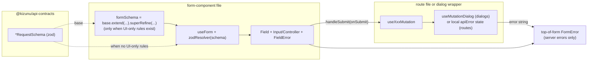

# 045 — Forms RHF + Zod — Design

**Spec**: `.specs/features/045-forms-rhf-zod/spec.md`
**Status**: Draft

---

## Architecture Overview

The change is a doctrine swap, not a topology change. The form-component
boundary moves from "owns state, owns validation, owns submit" to "owns
nothing but a `useForm` instance bound to a contract schema". The parent
keeps owning side-effects (mutation, navigation, toast, server-error
capture) — unchanged from feature 044's dumb-form split.



The four pieces that move:

1. **Validation source** shifts from "native `required` + ad-hoc helpers" to
   `zodResolver(<contract schema>)`. UI-only rules become a derived schema
   inside the form file.
2. **Field state** shifts from per-field `useState` to RHF's internal store.
3. **Error surface** splits cleanly: field-level errors (RHF) →
   `<FieldError id="<field>-error">`; server errors (mutation) →
   top-of-form `<FormError>`. Both can render concurrently when the user
   fixes field errors but the API still rejects.
4. **Auth form ownership** shifts: the form component becomes a pure dumb
   form, and the route file becomes the smart page (mutation + navigation +
   header + submit button).

---

## Code Reuse Analysis

### Existing components to leverage

| Component | Location | How to use |
| --- | --- | --- |
| `useForm` | `react-hook-form` v7.72 (installed) | Field-state owner inside every form. Always typed `<TRequest>`. |
| `zodResolver` | `@hookform/resolvers/zod` v5.2 (installed) | Bridges contract schema → RHF errors. |
| `Controller` | `react-hook-form` | Wrap every controlled component (Select-style). RHF `register` cannot reach into a `<Select onValueChange>` because there's no native form value. |
| `Field`, `FieldLabel`, `FieldError`, `FieldGroup` | `apps/web/src/components/primitives/field.tsx` | The composition layer for every input. `FieldError` already accepts either `children` or `errors[]` — both work; we use `children={errors.<field>?.message}` per the reference. |
| `Input`, `Textarea` | `apps/web/src/components/primitives/input.tsx`, `textarea.tsx` | Spread props through native input; `register()` ref/onChange/onBlur flow cleanly. The `aria-invalid:*` Tailwind variant is already styled. |
| `FormError` | `apps/web/src/components/composed/form-error.tsx` | Top-of-form **server-error-only** banner. Same component, narrower semantics. |
| `ResourceDialog` | `apps/web/src/components/composed/resource-dialog.tsx` | Unchanged — `formId` binds the external submit button to `<form id={formId}>`. The dumb-form contract already matches. |
| `useMutationDialog` | `apps/web/src/lib/use-mutation-dialog.ts` | Unchanged — owns dialog-server-error state + clear-on-close. |
| `getApiErrorMessage` | `apps/web/src/lib/get-api-error-message.ts` | Unchanged — extracts message from `ApiError`/`Error`. |
| `LookupSelect`, `PluginSelect`, `CredentialFieldsInput` | `apps/web/src/components/composed/`, `routes/_app/settings/-components/channels/` | Unchanged. Wrapped in `<Controller>` inside each form. Existing `disabled` props are passed through `render={({ field }) => <X disabled={isPending} ... />}`. |
| `mapLoginError` | `apps/web/src/routes/auth/-utils/login-error-copy.ts` | Unchanged — applied at the smart-page boundary on `useLogin`'s `error`, not inside the form. |

### Integration points

| System | Integration method |
| --- | --- |
| `@kizunu/api-contracts/*` | Each form's `useForm<TRequest>` ties to the package's exported `*RequestSchema`. Two new contracts (`CreateEntryTriggerRequestSchema`, `CreateTemplateRequestSchema`) added under existing bounded-context dirs. |
| `@kizunu/api-client/*` | Mutation hooks already return `{ <domainName>: mutate, isPending, error }` per feature 043. No changes to the api-client package. |
| TanStack Router | Auth routes (`routes/auth/login.tsx`, etc.) become smart pages. No route registration changes (the files exist). |

### CONCERNS.md check

`.specs/codebase/CONCERNS.md` carries pilot-hardening items (mail transport,
CRM-owner mapping, webhook signing, etc.) — none touch form-level web code.
No design mitigation needed.

---

## Components

### Form file shape (the recipe)

- **Purpose**: own `useForm` bound to a contract schema; render fields; emit
  typed `onSubmit`. Nothing else.
- **Location**: `apps/web/src/routes/**/-components/<feature>-form.tsx`
- **Interfaces**: props
  - `id: string` — DOM `id` for the `<form>`. Parent binds the submit
    button via `<Button form={id} type="submit">`.
  - `defaultValues?: Partial<TRequest>` — for edit dialogs (future); omitted
    for create.
  - `isPending: boolean` — applied to every input as `disabled={isPending}`.
  - `onSubmit: (data: TRequest) => void` — receives a typed, validated
    payload. Parent maps to mutation input.
  - `error?: string | null` — server-error string from the parent's
    `useMutationDialog` (dialog forms) or local capture (auth routes).
- **Dependencies**: `react-hook-form`, `@hookform/resolvers/zod`, the
  contract package, `Field*` primitives, `FormError`.
- **Reuses**: every primitive listed in §Code Reuse.

Canonical code (this becomes the §3 rule example):

```tsx
import { zodResolver } from '@hookform/resolvers/zod'
import {
  type CreateInstrumentRequest,
  CreateInstrumentRequestSchema,
} from '@kizunu/api-contracts/instrument/create-instrument.contract'
import { FormError } from '@kizunu/web/components/composed/form-error'
import { Field, FieldError, FieldGroup, FieldLabel }
  from '@kizunu/web/components/primitives/field'
import { Input } from '@kizunu/web/components/primitives/input'
import { useForm } from 'react-hook-form'

interface InstrumentFormProps {
  id: string
  defaultValues?: Partial<CreateInstrumentRequest>
  isPending: boolean
  error?: string | null
  onSubmit: (data: CreateInstrumentRequest) => void
}

export function InstrumentForm(props: InstrumentFormProps) {
  const { id, defaultValues, isPending, error, onSubmit } = props
  const {
    register,
    handleSubmit,
    formState: { errors },
  } = useForm<CreateInstrumentRequest>({
    resolver: zodResolver(CreateInstrumentRequestSchema),
    defaultValues,
  })

  return (
    <form id={id} onSubmit={handleSubmit(onSubmit)}>
      <FieldGroup>
        {error && <FormError>{error}</FormError>}
        <Field>
          <FieldLabel htmlFor="name">Name</FieldLabel>
          <Input
            id="name"
            aria-invalid={!!errors.name}
            aria-describedby={errors.name ? 'name-error' : undefined}
            disabled={isPending}
            {...register('name')}
          />
          {errors.name && (
            <FieldError id="name-error">{errors.name.message}</FieldError>
          )}
        </Field>
      </FieldGroup>
    </form>
  )
}
```

### Controller pattern (for controlled components)

```tsx
import { Controller } from 'react-hook-form'

<Controller
  name="cadenceId"
  control={control}
  render={({ field, fieldState }) => (
    <Field>
      <FieldLabel>Cadence</FieldLabel>
      <LookupSelect
        value={field.value ?? ''}
        onChange={field.onChange}
        placeholder="Select cadence"
        options={cadenceOptions}
        disabled={isPending}
      />
      {fieldState.error && (
        <FieldError id="cadenceId-error">{fieldState.error.message}</FieldError>
      )}
    </Field>
  )}
/>
```

### Derived schema pattern (for UI-only rules)

When the contract doesn't carry every field the UI needs, or when a
cross-field rule is UI-only:

```tsx
const formSchema = ConfirmPasswordResetSchema.extend({
  confirmPassword: z.string().min(MIN_PASSWORD_LENGTH),
}).superRefine(({ password, confirmPassword }, ctx) => {
  if (password !== confirmPassword) {
    ctx.addIssue({
      code: 'custom',
      path: ['confirmPassword'],
      message: "Passwords don't match.",
    })
  }
})

type FormValues = z.infer<typeof formSchema>
```

The derived schema lives in the form file (a `const` above the component).
The contract stays a pure mirror of the API DTO.

### Smart-page shape (auth routes)

- **Purpose**: own the mutation hook, render the page chrome (`PageHeader`,
  side links, success/error sub-states), and pass `id` / `isPending` /
  `error` / `onSubmit` into the dumb form.
- **Location**: `apps/web/src/routes/auth/{login,signup,forgot-password,reset-password}.tsx`
- **Interfaces**: `Route.component` reads route params (e.g. `token` for
  reset-password) and renders `<XForm id="…" isPending={…} error={…} onSubmit={(data) => mutation(data)} />`
  alongside the submit button (`<Button form={id} type="submit">`).
- **Dependencies**: the corresponding `useLogin`/`useRegister`/etc. from
  `@kizunu/api-client/identity/*`, `useNavigate` from `@tanstack/react-router`.
- **Reuses**: `PageHeader`, `Button`, `FormError`, `mapLoginError`.

The submit button moves **outside** the `<form>` and uses `form={id}`. This
matches the dialog pattern and removes the need for the form component to
know about the button's existence.

### ResourceDialog wrapper shape (dialog forms)

Unchanged. Continues to pass `formId` through. The wrapper's contract:

```tsx
const formId = 'create-instrument-form'
const { error, captureError, handleOpenChange } =
  useMutationDialog({ open, onOpenChange })
const { createInstrument, isPending } = useCreateInstrument({
  onSuccess: () => { toast.success('Instrument created'); handleOpenChange(false) },
  onError: captureError,
})

return (
  <ResourceDialog
    open={open}
    onOpenChange={handleOpenChange}
    title="New instrument"
    formId={formId}
    actionLabel="Create"
    isPending={isPending}
  >
    <InstrumentForm
      id={formId}
      isPending={isPending}
      error={error}
      onSubmit={createInstrument}
    />
  </ResourceDialog>
)
```

The wrapper does NOT pass `defaultValues` for create (form uses RHF's empty
default); future edit dialogs will pass `defaultValues={existing}`.

---

## Per-form mapping

The 10 forms break into four migration archetypes. Each entry below names
the contract source, the controlled fields (if any), and the UI-only rules
that need a derived schema.

| # | Form | Contract source | Controlled fields | Derived schema needed? | Auth-style split? |
| --- | --- | --- | --- | --- | --- |
| 1 | `routes/auth/-components/login-form.tsx` | `LoginRequestSchema` | none | no — direct | yes (split to `routes/auth/login.tsx`) |
| 2 | `routes/auth/-components/signup-form.tsx` | `RegisterRequestSchema` | none | no — direct | yes (split to `routes/auth/signup.tsx`) |
| 3 | `routes/auth/-components/forgot-password-form.tsx` | `RequestPasswordResetSchema` | none | no — direct | yes (split to `routes/auth/forgot-password.tsx`) |
| 4 | `routes/auth/-components/reset-password-form.tsx` | `ConfirmPasswordResetSchema` | none | **yes** — adds `confirmPassword` + `.superRefine` for match rule + `MIN_PASSWORD_LENGTH` | yes (split to `routes/auth/reset-password.tsx`) |
| 5 | `routes/_app/settings/-components/members/invite-member-form.tsx` | `InviteMemberRequestSchema` | none | no — direct | no (already dumb; dialog already smart) |
| 6 | `routes/_app/settings/-components/channels/channel-account-form.tsx` | `CreateChannelAccountRequestSchema` | `PluginSelect` for `pluginId`; one `Controller` per dynamic credential field under `credentials.<key>` | **yes** — `.superRefine` checking that every `userInputFields(plugin)` credential is filled when `pluginId` is set | no |
| 7 | `routes/_app/settings/-components/channels/grant-channel-access-form.tsx` | `GrantChannelAccessRequestSchema` (only carries `userId`; path-param `accountId` lives in the URL) | two `LookupSelect`s (`accountId`, `userId`) | **yes** — extends base with `accountId: z.uuid()` so RHF owns both fields; the smart wrapper destructures `{ accountId, userId }` and forwards only `{ userId }` to the path-bound mutation | no |
| 8 | `routes/_app/settings/-components/connectors/connector-account-form.tsx` | `CreateConnectorAccountRequestSchema` (`credentials: z.record(string, unknown)`) | `LookupSelect` for `connectorId`; `Textarea` for raw-JSON credentials | **yes** — `.extend({ credentialsRaw: z.string() }).superRefine` parses the JSON via `parseJsonObject` and rebinds `credentials = parsed`. `onSubmit` strips `credentialsRaw` before forwarding. | no |
| 9 | `routes/_app/settings/-components/connectors/entry-trigger-form.tsx` | **NEW** `CreateEntryTriggerRequestSchema` (lifted) | two `LookupSelect`s (`connectorAccountId`, `cadenceId`) + an `Input` for `stageId` | no — direct (the lifted contract is the full UI shape) | no |
| 10 | `routes/_app/workspace/-components/cadences/template-form.tsx` | **NEW** `CreateTemplateRequestSchema` (lifted) | `PluginSelect` for `channelPluginId` | no — direct | no |

### What about non-form components that the rule touches?

- `apps/web/src/routes/auth/-components/labeled-input.tsx` is **deleted**.
  Every auth form re-composes `<Field>` + `<FieldLabel htmlFor>` + `<Input>` directly,
  matching the reference. This change is touched by every auth form; doing
  it alongside the auth split keeps the diff coherent.

---

## Data models

No DB schema changes. The two new contract files mirror existing API
shapes; they don't introduce columns. Their schemas:

### `CreateEntryTriggerRequestSchema`

```ts
// packages/api-contracts/src/connector/create-entry-trigger.contract.ts
import { z } from 'zod'

export const CreateEntryTriggerRequestSchema = z.object({
  connectorAccountId: z.uuid(),
  cadenceId: z.uuid(),
  stageId: z.string().min(1).max(255),
  pipelineId: z.uuid().nullable(),
})

export type CreateEntryTriggerRequest = z.infer<typeof CreateEntryTriggerRequestSchema>
```

Mirrors the existing `EntryTriggerFormValues` interface in
`entry-trigger-form.tsx` (lines 9-14 today) and the corresponding API
DTO. Verify at implementation time that the API controller's input
matches; if not, align (the contract IS the truth — if the controller
diverges, the controller is wrong).

### `CreateTemplateRequestSchema`

```ts
// packages/api-contracts/src/cadence/create-template.contract.ts
import { z } from 'zod'

export const CreateTemplateRequestSchema = z.object({
  name: z.string().min(1).max(120),
  channelPluginId: z.string().min(1).max(100),
  providerTemplateName: z.string().min(1).max(255),
  language: z.string().min(2).max(20),
  variables: z.array(z.string()).default([]),
})

export type CreateTemplateRequest = z.infer<typeof CreateTemplateRequestSchema>
```

Mirrors `TemplateFormValues` (template-form.tsx:7-13). Same verification
note applies.

**Both contracts get re-exported through their bounded-context barrel**
(`packages/api-contracts/src/connector/index.ts`,
`packages/api-contracts/src/cadence/index.ts`).

---

## Error handling strategy

| Error scenario | Handling | User impact |
| --- | --- | --- |
| Field missing / malformed at submit | `zodResolver` populates `errors.<field>`; `<FieldError id="<field>-error">{errors.<field>.message}</FieldError>` renders inside the field; `aria-invalid` + `aria-describedby` mark the input | User sees red border on the offending input + the contract message ("Required", "Invalid email", etc.); screen readers announce the error. |
| Cross-field rule (confirmPassword match, JSON parse, plugin-required credentials) | Derived `formSchema` `.superRefine` adds an issue at the target `path`; renders identically to a contract error | Same as above; the rule lives next to the form. |
| Server rejects (duplicate name, expired token, business-rule 422) | Mutation `onError` → `captureError` (dialog) or local `setError` (route) → string in `error` prop → `<FormError>{error}</FormError>` at the top of the form | User sees a top-of-form banner; field-level errors stay clear (or carry whatever zod said before submit). |
| Network failure / 500 | Same as above — `getApiErrorMessage` returns a generic fallback | Top-of-form banner with the fallback copy. |
| Submit in flight | `disabled={isPending}` on every input; RHF blocks re-submit via `handleSubmit` | Inputs/button disabled; spinner on the action button (`ResourceDialog`'s `loading={isPending}`). |
| Dialog close mid-submit | `handleOpenChange` (from `useMutationDialog`) clears the server error on close; RHF state is recreated on next open | Next open is clean. |

---

## Tech decisions (non-obvious)

| Decision | Choice | Rationale |
| --- | --- | --- |
| Where do UI-only rules live? | Derived `formSchema` in the form file via `.extend(...).superRefine(...)` | Contracts stay pure mirrors of the API DTO; UI-only rules don't leak into `@kizunu/api-contracts`. Locked in clarification §3. |
| `useZodForm` wrapper helper? | No — direct `useForm + zodResolver` per form file | Matches reference exactly; one fewer thing to learn; the two extra imports per file are negligible. Locked in clarification §4. |
| `Controller` vs. RHF's `setValue` for `LookupSelect`? | `Controller` | `Controller` is the documented RHF idiom for controlled components and gives field-level error state (`fieldState`) cleanly. `setValue` requires manual subscription to errors. |
| `defaultValues` for create forms? | Omit | RHF defaults to undefined per field; zod's `.optional()` / required validation runs on submit. Edit dialogs (when introduced) pass `defaultValues={existing}`. |
| Where does the submit button render? | Outside the `<form>`, via `<Button form={id} type="submit">` | Already the pattern in every dialog form. Auth routes inherit it via the split. |
| Should the dialog wrapper invoke `RHF` itself (e.g. trigger reset on close)? | No | `useMutationDialog` already clears server error on close; the form's RHF state is recreated by React when the dialog unmounts/remounts. If a "persisted state across close" need arises, add it explicitly then. |
| Should we use `mode: 'onBlur'` / `'onChange'` for live validation? | No (default `mode: 'onSubmit'`) | The reference uses the default. Live validation is a separate UX call; consider per-form if a real need arises. Keeps current "submit, see errors" behavior. |
| Do we touch the `CadenceBuilder` component? | No | It's not a `*-form.tsx` and its step-array editing is not a single submit. Out of scope (spec §Out of Scope). |
| Auth forms become dumb — what happens to `mapLoginError`? | Stays in `routes/auth/-utils/login-error-copy.ts`; the smart-page calls it on `useLogin`'s `error` to produce the `error` string passed into the form's top `<FormError>`, plus the optional sign-up link copy | Preserves the auth-specific error-copy mapping without coupling it to the form. |
| Test impact — does the `channel-account-form.spec.tsx` need rewrite or update? | Update (not rewrite) | The visible behavior — "submit empty → user can't proceed; submit valid → form emits the right payload" — stays the same, but assertion lookups shift from "find FormError text" to "find FieldError text per field". The spec already mocks the credentials lookup; the new assertions slot in. |
| Where do the new contracts' barrels live? | `packages/api-contracts/src/connector/index.ts` and `packages/api-contracts/src/cadence/index.ts` (existing barrels per the bounded-context convention) | Matches the existing layout; no new barrel files. |

---

## Test strategy

Per `.specs/codebase/TESTING.md` + AGENTS.md "Testing" + the
`generate-tests` skill mandate:

- **Thin code** (forms with only `useForm` + `register` + JSX) — covered by
  the existing one fat-component test (`channel-account-form.spec.tsx`) plus
  the Chrome smoke walk (the success-criteria checklist). No per-form unit
  tests for the "render and submit" path — that's a typecheck + behavior
  shared with every other form.
- **Fat code** added in this branch:
  - `reset-password-form.tsx` derived schema (`.superRefine` confirmPassword
    match) — a unit test on the derived `formSchema` (input → issues) is the
    right level (covers the rule independently of RHF wiring).
  - `connector-account-form.tsx` derived schema (`credentialsRaw` JSON parse
    + rebind) — same: a unit test on `formSchema` covers the parse rule.
  - `channel-account-form.tsx` derived schema (`.superRefine` plugin-required
    credentials) — same: unit test on the schema.
- **Updated**: `channel-account-form.spec.tsx` — adjust the assertion to
  look up field-level errors (`getByText('Required')` near the field, not at
  the top banner) for the rule's invalid-submit cases.

The `generate-tests` skill is invoked per-task (where authoring tests is
the task) — not preemptively in design. Design only declares the test
shape.

---

## Validation gates (per AGENTS.md §"Definition of Done")

The Execute phase runs each task through its own verify step (per
`tasks.md`). The branch-level gate is `bun check` + the four `check-*.ts`
scripts + `CI=1 bunx vp lint` (0 warnings). The post-branch gate is the
`thermo-nuclear-code-quality-review` skill. Both happen autonomously per the
AGENTS.md flow.

---

## Open questions for Tasks phase

None — the spec, the four locked decisions, and the per-form mapping fully
constrain the implementation. Tasks can be derived directly from the
per-form table and the doctrine-first sequence.
