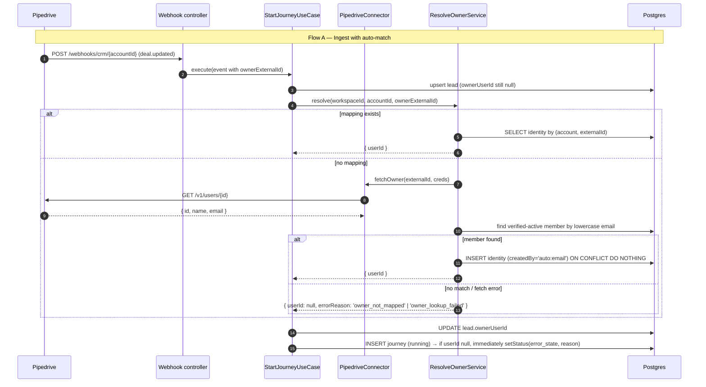
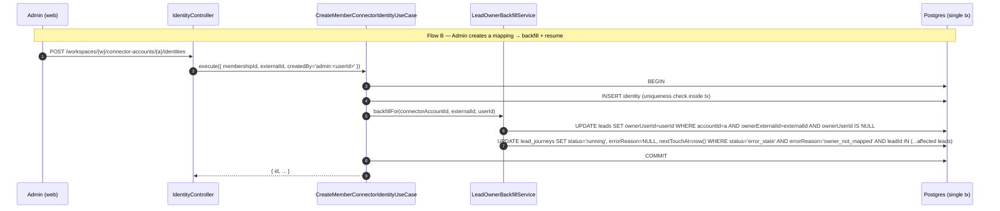

# 047 — CRM Owner Mapping Design

**Spec:** `.specs/features/047-crm-owner-mapping/spec.md`
**Context:** `.specs/features/047-crm-owner-mapping/context.md`
**Status:** Draft

---

## Architecture Overview

Two new artifacts, one optional port method, and a schema delta:

1. **`MemberConnectorIdentity` aggregate** — workspace-owned, keyed
   `(membershipId, connectorAccountId, externalId)`, lives in
   `apps/api/src/modules/crm/`. Mirrors the existing `ConnectorAccount`
   shape (also workspace-owned, also under `modules/crm/`).
2. **`CRMConnector.fetchOwner(externalId, credentials): Promise<NormalizedOwner | null>`**
   — optional method on the frozen D3 port. Connectors that support
   owner enrichment implement it; others skip auto-match (Pipedrive
   implements; future RD Station / HubSpot may or may not).
3. **`lead_journeys.errorReason: varchar(80)`** — new nullable column.
   The closed vocabulary lives as a `LeadJourneyErrorReason` const
   object in `modules/engine/core/domain/` per the ADR-002 / enums-rule
   pattern; the column itself stays a free `varchar` so future plugins
   can emit their own reasons without a `pgEnum` migration each time.
4. **Backfill + resume transaction** — when admin creates or updates a
   mapping, the use case runs three writes in **one Postgres tx**:
   persist the mapping; update `leads.ownerUserId` for matching rows;
   update `lead_journeys.status / errorReason / nextTouchAt` for journeys
   parked on the matching leads.

Two flows touch this:





---

## Code Reuse Analysis

### Existing Components to Leverage

| Component | Location | How to Use |
| --- | --- | --- |
| `ConnectorAccount` aggregate + repo | `apps/api/src/modules/crm/persistence/connector-account.repository.ts` | Mirror the shape — workspace-owned, FK cascade, `findByIdInWorkspace`. The new identity aggregate follows the same idiom. |
| `LeadRepository.upsert` + `reassign` | `apps/api/src/modules/engine/persistence/lead.repository.ts` | Extend with two new methods: `findIdsByOwnerExternalId(accountId, externalId)` (read) and `backfillOwnerUserId(accountId, externalId, userId)` (write). |
| `LeadJourneyRepository.setStatus` + `resumePausedForOwner` | `apps/api/src/modules/engine/persistence/lead-journey.repository.ts` | Pattern for status transitions backed by lead-set queries. Add `resumeErrorStateByLeadsAndReason(tx, leadIds, reason)` mirroring the existing helper. |
| `LeadJourneyStatus` const object + `Assert<Equal<...>>` | `apps/api/src/modules/engine/core/domain/lead-journey-status.ts` + `lead-journeys.ts` schema | No change. Reason is orthogonal to status — same `error_state` value, new `errorReason` carries the why. |
| `DrizzleService.db.transaction(async tx => ...)` + `DbTransaction` type | `@kizunu/nestjs-shared/modules/persistence/services/drizzle.service` + `modules/engine/persistence/transaction.ts` | Wraps the create-mapping → backfill-leads → resume-journeys sequence in one Postgres tx. Same pattern the dispatcher uses. |
| `PipedriveApi.request` private helper | `apps/api/src/modules/crm/plugins/pipedrive/pipedrive-api.ts` | Add a `fetchOwner` method calling `GET /v1/users/{id}` via the existing helper. No new HTTP plumbing. |
| Workspace-membership guard pattern | `apps/api/src/modules/workspace/http/guards/` (the same one connector-accounts controller uses) | Reuse on the new controller — only members of the workspace can read/write its identities. |
| `EncryptedCredentialsService` | `@kizunu/nestjs-shared/modules/persistence/services/encrypted-credentials.service` | No change. Mapping rows hold no secret data; `ConnectorAccount.credentials` already passes through this layer when ingestion reads creds. |
| `web-patterns.md` form recipes | `.agents/rules/web-patterns.md` §3, §6, §8 | The admin UI is a standard CRUD slice: trigger-button → `ResourceDialog` with a `react-hook-form + zod` dumb form, mutation hook returning `{ createMemberConnectorIdentity: mutate, ... }`. |

### Integration Points

| System | Integration Method |
| --- | --- |
| `StartJourneyUseCase` | New constructor dependency `ResolveOwnerService` (`apps/api/src/modules/crm/core/services/`). Replaces the today-null `ownerUserId` with `resolve(...)`. |
| `CRMConnector` port (D3) | New **optional** method `fetchOwner?(externalId, credentials): Promise<NormalizedOwner \| null>` — does not break the frozen contract, mirrors how `ChannelPlugin.onAccountCreated?` was added in feature 029. |
| `@kizunu/api-contracts/crm` | New `member-connector-identity.contract.ts`: list/create/update/delete schemas + `Routes.crm.identities.{list,create,update,remove}` entries. |
| `@kizunu/api-client/crm` | New `member-connector-identity.api.ts` + `use-create-member-connector-identity.ts` etc. Mutation hooks follow ADR-007 §8 shape (`{ createMemberConnectorIdentity: mutate, ... }`). |
| `apps/web/src/routes/_app/settings/connectors/$accountId/` | New folder per `web-patterns.md` §1. Tab/section "Member identities" lists current mappings, "Add identity" → `ResourceDialog` with a `useForm({ resolver: zodResolver(CreateMemberConnectorIdentitySchema) })` form. |
| `GET /auth/me` | Optional response extension `connectorIdentities: [...]` (`@kizunu/api-contracts/identity`). The identity controller queries `MemberConnectorIdentityRepository.listForUser`. P2 — can ship after P1. |

### CONCERNS.md alignment

This feature **directly closes** the HIGH item *"Dispatcher gaps: owner
mapping, sendingWindow, template variables"* (the owner-mapping sub-bullet).
The design also touches `lead_journeys` and `start-journey.use-case.ts` which
already had focused integration tests (`feature 008`); the new branches need
focused tests via `generate-tests` as part of Tasks.

The schema delta adds a column without changing any existing column's
nullability or default — the migration is additive and idempotent across the
mid-Phase-1.7 "migrations on every boot" model. No production data exists
yet, so backfill of historical journeys' `errorReason` is unnecessary.

---

## Components

### `MemberConnectorIdentity` aggregate

- **Purpose:** Maps a workspace member to a Pipedrive (or other connector)
  user identity, scoped to one `ConnectorAccount`.
- **Location:** `apps/api/src/modules/crm/core/identity/` (domain + types)
  + `apps/api/src/modules/crm/persistence/member-connector-identity.repository.ts`.
- **Interfaces:**
  - `MemberConnectorIdentity` type — `{ id, workspaceId, membershipId, connectorAccountId, externalId, createdBy, sourceEmail, createdAt, updatedAt }`.
  - `MemberConnectorIdentityCreatedBy = 'auto:email' | 'admin:<userId>'` — closed vocabulary as a tagged-string. Tagged because the `userId` suffix is genuinely dynamic; a const-object doesn't help here.
- **Dependencies:** Drizzle schema (new), `MembershipRepository.findByIdInWorkspace` (to validate `membershipId` belongs to the workspace).
- **Reuses:** `defaults()` schema mixin (uuid + timestamps) per `.agents/rules/conventions.md` §2.

### `MemberConnectorIdentityRepository`

- **Purpose:** CRUD + lookup operations on the identity table.
- **Location:** `apps/api/src/modules/crm/persistence/member-connector-identity.repository.ts`.
- **Interfaces:**
  - `findByExternal(tx, connectorAccountId, externalId): Promise<{ id, userId } | undefined>` — used by `ResolveOwnerService` during ingestion (no auto-create) and by create/update use cases (conflict check).
  - `listByConnectorAccount(workspaceId, connectorAccountId): Promise<IdentityListRow[]>` — joins `memberships` + `users` so the admin UI shows `{ id, userId, userEmail, userName, externalId, createdBy, createdAt }`.
  - `listForUser(userId): Promise<{ workspaceId, connectorAccountId, connectorId, externalId }[]>` — feeds `/auth/me` (P2).
  - `create(tx, input): Promise<{ id }>` — inserts; relies on the partial unique indexes for conflict resolution.
  - `updateMembership(tx, id, membershipId): Promise<{ updated: boolean }>` — admin re-points an externalId to a different member.
  - `delete(tx, id, workspaceId): Promise<{ deleted: boolean }>`.
- **Dependencies:** `DrizzleService`, `DbTransaction` type.
- **Reuses:** `ConnectorAccountRepository`'s structure (workspace-scoped reads, drizzle's `onConflictDoNothing` patterns).

### `ResolveOwnerService`

- **Purpose:** Single-call seam ingestion uses to turn a Pipedrive
  `ownerExternalId` into a Kizunu `userId` (or a documented "why not").
  Encapsulates the cache-then-fetch-then-match-then-persist sequence so
  `StartJourneyUseCase` stays orchestration-only.
- **Location:** `apps/api/src/modules/crm/core/services/resolve-owner.service.ts`.
- **Interfaces:**
  - `resolve(input: { workspaceId, connectorAccountId, connectorId, credentials, ownerExternalId }): Promise<ResolveOwnerOutput>` where
    `ResolveOwnerOutput = { userId: string } | { userId: null, errorReason: 'owner_not_mapped' | 'owner_lookup_failed' }`.
- **Dependencies:** `MemberConnectorIdentityRepository`, `CrmConnectorRegistry` (to call `fetchOwner?`), `UserRepository.findVerifiedActiveByEmail(workspaceId, lowercaseEmail)` (a new read method).
- **Reuses:** `CrmConnectorRegistry.get(connectorId).fetchOwner?(externalId, credentials)`. If `fetchOwner` is undefined (connector doesn't support owner enrichment), returns `{ userId: null, errorReason: 'owner_not_mapped' }` without erroring — the connector's choice not to enrich is documented behavior.

### `LeadOwnerBackfillService`

- **Purpose:** The cross-cutting "fix-up after admin mapping" — given a
  newly-resolved `(connectorAccountId, externalId, userId)`, set
  `leads.ownerUserId` on matching rows and resume `error_state /
  owner_not_mapped` journeys.
- **Location:** `apps/api/src/modules/crm/core/services/lead-owner-backfill.service.ts`.
  Lives in `crm/` because it's invoked from the mapping use cases; engine
  exposes the two repository methods it calls. (Alternative: place in
  `engine/`. CRM placement keeps the use-case → service → repo chain inside
  one module while still using engine-exported repo methods.)
- **Interfaces:**
  - `backfillFor(tx, input: { connectorAccountId, externalId, userId, clock }): Promise<{ leadsUpdated: number, journeysResumed: number }>`.
- **Dependencies:** `LeadRepository.backfillOwnerUserId(tx, ...)` (new),
  `LeadJourneyRepository.resumeErrorStateByLeadsAndReason(tx, ...)` (new),
  `Clock`.
- **Reuses:** Existing `DbTransaction` type so the caller controls the
  transaction boundary.

### `CreateMemberConnectorIdentityUseCase` / `UpdateMemberConnectorIdentityUseCase` / `DeleteMemberConnectorIdentityUseCase` / `ListMemberConnectorIdentitiesUseCase`

- **Purpose:** Standard CRUD over the new aggregate, plus the side-effect
  hook into the backfill service for create + update.
- **Location:** `apps/api/src/modules/crm/core/use-cases/`.
- **Interfaces:** Per-use-case input types in their own files
  (`code-standards.md` §11). All four return `{ id }` / `void`.
- **Dependencies:**
  - Create / Update → `DrizzleService.db.transaction`, `MemberConnectorIdentityRepository`, `LeadOwnerBackfillService`, `MembershipRepository.findByIdInWorkspace` (validation), the existing `ConnectorAccountRepository.findByIdInWorkspace` (validation).
  - Delete → repository only (decided in spec: mapping deletion does not unwind historical leads).
  - List → repository's `listByConnectorAccount`.
- **Reuses:** Conflict-to-422 translation via a new `MemberConnectorIdentityConflictException` (subclasses `BusinessRuleException` — same path connector-account errors use today).

### `MemberConnectorIdentityController`

- **Purpose:** HTTP edge for admin CRUD.
- **Location:** `apps/api/src/modules/crm/http/controllers/member-connector-identity.controller.ts`.
- **Interfaces (REST):**
  - `GET    /workspaces/:workspaceId/connector-accounts/:connectorAccountId/identities`
  - `POST   /workspaces/:workspaceId/connector-accounts/:connectorAccountId/identities`
  - `PATCH  /workspaces/:workspaceId/connector-accounts/:connectorAccountId/identities/:id`
  - `DELETE /workspaces/:workspaceId/connector-accounts/:connectorAccountId/identities/:id`
- **Dependencies:** the four use cases, the workspace-membership guard, the `ZodValidationPipe` (DTOs created from the new contract via `createZodDto`).
- **Reuses:** All controller infra. Adds nothing new at the HTTP layer.

### `MeController` extension (P2)

- **Purpose:** Surface a BDR's own mappings in `GET /auth/me`.
- **Location:** existing `apps/api/src/modules/identity/http/controllers/me.controller.ts`.
- **Interfaces:** Existing endpoint; response gains
  `connectorIdentities: ConnectorIdentitySummary[]`.
- **Dependencies:** `MemberConnectorIdentityRepository.listForUser` —
  `identity` imports from `crm`, **not** the reverse, so no module cycle.
  (CRM does not import identity today; this addition is one-way.)
- **Reuses:** Same module-import direction the rest of `identity` already
  follows for workspace data.

### `LeadJourneyErrorReason` const object

- **Purpose:** Closed vocabulary for `lead_journeys.errorReason` values
  the engine itself emits. Mirrors the const-object + derived-type pattern
  from `.agents/rules/enums.md` §1.
- **Location:** `apps/api/src/modules/engine/core/domain/lead-journey-error-reason.ts`.
- **Initial values:**
  ```typescript
  export const LeadJourneyErrorReason = {
    NoChannel: 'no_channel',
    TemplateRequired: 'template_required',
    OwnerNotMapped: 'owner_not_mapped',
    OwnerLookupFailed: 'owner_lookup_failed',
  } as const

  export type LeadJourneyErrorReason =
    (typeof LeadJourneyErrorReason)[keyof typeof LeadJourneyErrorReason]
  ```
- **Note:** The column itself is a free `varchar(80)` — plugins outside
  the engine may emit reasons not in this enum. The const object is for
  the engine's own use; nothing prevents future plugin-emitted strings.

### `member_connector_identities` schema + migration

- **Purpose:** Persistence for the new aggregate.
- **Location:** `apps/api/src/db/schemas/member-connector-identities.ts`
  + auto-generated migration under `apps/api/drizzle/`.
- **Shape:**
  ```typescript
  export const memberConnectorIdentities = pgTable(
    'member_connector_identities',
    {
      ...defaults(),
      workspaceId: uuid()
        .notNull()
        .references(() => workspaces.id, { onDelete: 'cascade' }),
      membershipId: uuid()
        .notNull()
        .references(() => memberships.id, { onDelete: 'cascade' }),
      connectorAccountId: uuid()
        .notNull()
        .references(() => connectorAccounts.id, { onDelete: 'cascade' }),
      externalId: varchar({ length: 120 }).notNull(),
      createdBy: varchar({ length: 80 }).notNull(),
      sourceEmail: varchar({ length: 255 }),
    },
    (table) => [
      uniqueIndex('mci_account_external_idx').on(table.connectorAccountId, table.externalId),
      uniqueIndex('mci_account_membership_idx').on(table.connectorAccountId, table.membershipId),
    ],
  )
  ```
- **Indexes rationale:**
  - `mci_account_external_idx` enforces "one externalId per
    connectorAccount" (mapping must be unique on the wire-side identity).
  - `mci_account_membership_idx` enforces "one externalId per member per
    connectorAccount" (a member can't have two Pipedrive identities on the
    same account — surfaces accidental admin overrides as 422 conflicts).
- **No explicit column names** per `.agents/rules/conventions.md` §2 — the
  `casing: 'snake_case'` config derives them.

### `lead_journeys.errorReason` schema delta

- **Purpose:** Carry the why-of-error_state.
- **Location:** add to existing `apps/api/src/db/schemas/lead-journeys.ts`.
- **Shape:** `errorReason: varchar({ length: 80 })` — nullable.
- **Migration:** Single `ALTER TABLE lead_journeys ADD COLUMN error_reason
  varchar(80)`. Auto-generated by `bun db:generate`.
- **Repository updates:**
  - `setStatus(tx, id, status, errorReason?)` gains an optional third
    argument. When `status = 'running' | 'replied' | …` (anything except
    `error_state`), the column is set to `NULL`.
  - `lockById` joined select adds `errorReason` to the projection so the
    dispatcher can read it.
  - The dispatcher's existing "no channel" branch (which today calls
    `setStatus(tx, id, 'error_state')` somewhere — feature 009) gets the
    `LeadJourneyErrorReason.NoChannel` reason wired through. Out-of-scope
    behavior change beyond this feature: explicitly *not* touching the
    `TemplateRequired` reason — that's feature `048`.

---

## Data Models

### `MemberConnectorIdentity`

```typescript
export interface MemberConnectorIdentity {
  id: string
  workspaceId: string
  membershipId: string
  connectorAccountId: string
  externalId: string
  createdBy: string
  sourceEmail: string | null
  createdAt: Date
  updatedAt: Date
}

export type MemberConnectorIdentityCreatedBy = `auto:email` | `admin:${string}`
```

**Relationships:** `workspaceId` → `workspaces.id` (cascade);
`membershipId` → `memberships.id` (cascade); `connectorAccountId` →
`connector_accounts.id` (cascade).

### `NormalizedOwner` (new in `crm/core/connector/`)

```typescript
export interface NormalizedOwner {
  externalId: string
  name: string
  email: string | null
}
```

**Notes:** `email` is nullable because some CRMs surface owners without an
address (Pipedrive's `email` is technically optional on a user record). When
null, auto-match cannot proceed; the journey lands in `error_state`
reason `owner_not_mapped` — exactly the same path as no-match.

### Contract — `@kizunu/api-contracts/crm/member-connector-identity.contract.ts`

```typescript
export const MemberConnectorIdentitySchema = z.object({
  id: z.uuid(),
  membershipId: z.uuid(),
  userId: z.uuid(),
  userEmail: z.email(),
  userName: z.string(),
  externalId: z.string().min(1).max(120),
  createdBy: z.string().min(1).max(80),
  sourceEmail: z.email().nullable(),
  createdAt: z.iso.datetime(),
})

export const CreateMemberConnectorIdentityRequestSchema = z.object({
  membershipId: z.uuid(),
  externalId: z.string().min(1).max(120),
})

export const UpdateMemberConnectorIdentityRequestSchema = z.object({
  membershipId: z.uuid(),
})

export const ListMemberConnectorIdentitiesResponseSchema = z.object({
  items: MemberConnectorIdentitySchema.array(),
})
```

Routes (added to `Routes.crm.identities` in `@kizunu/api-contracts/src/routes/index.ts`):

```typescript
identities: {
  list: (workspaceId: string, connectorAccountId: string) =>
    `/workspaces/${workspaceId}/connector-accounts/${connectorAccountId}/identities`,
  create: (workspaceId: string, connectorAccountId: string) =>
    `/workspaces/${workspaceId}/connector-accounts/${connectorAccountId}/identities`,
  update: (workspaceId: string, connectorAccountId: string, id: string) =>
    `/workspaces/${workspaceId}/connector-accounts/${connectorAccountId}/identities/${id}`,
  remove: (workspaceId: string, connectorAccountId: string, id: string) =>
    `/workspaces/${workspaceId}/connector-accounts/${connectorAccountId}/identities/${id}`,
}
```

---

## Error Handling Strategy

| Scenario | Handling | User Impact |
| --- | --- | --- |
| `fetchOwner` throws (Pipedrive 5xx / network) | `ResolveOwnerService` catches, returns `{ userId: null, errorReason: 'owner_lookup_failed' }`. The exception is logged; ingestion continues. | Journey lands in `error_state` reason `owner_lookup_failed`; admin re-creates the mapping manually OR re-runs the Pipedrive stage transition once Pipedrive recovers. |
| `fetchOwner` returns email matching no member | `ResolveOwnerService` returns `{ userId: null, errorReason: 'owner_not_mapped' }`. | Same as above with `owner_not_mapped`. Admin creates the mapping; backfill resumes the journey. |
| `fetchOwner` returns email matching an *unverified* or *inactive* member | Treated as no-match (security: unverified emails cannot claim ownership). Returns `{ userId: null, errorReason: 'owner_not_mapped' }`. | Same as above. Admin either verifies/reactivates the user OR maps a different member explicitly. |
| Connector has no `fetchOwner` method (port-level opt-out) | `ResolveOwnerService` detects `undefined` and returns `{ userId: null, errorReason: 'owner_not_mapped' }` without invoking — no error. | Same as no-match; admin maps manually. |
| Race: two ingest events for the same `(account, externalId)` arrive concurrently with no mapping | Each invokes `fetchOwner` (idempotent), each tries to INSERT identity. One succeeds; the other catches the unique-index violation via `ON CONFLICT DO NOTHING`, then re-reads the winner's mapping. | Invisible — both leads end up with the same `ownerUserId`. |
| Admin creates a duplicate mapping (externalId or membership already mapped on this account) | Pre-check in the use case detects the conflict and throws `MemberConnectorIdentityConflictException` → `422 owner.mapping-conflict`. | UI surfaces the existing mapping in the error context (the conflicting row's id + member name). |
| Admin deletes a mapping referencing leads that have already been backfilled | Mapping row deleted; affected leads keep their `ownerUserId` (spec OWNER-14). Future deals from the same Pipedrive externalId will re-trigger auto-match. | No journey side-effects. |
| Membership cascade-deletes (admin removes the member from the workspace) | FK cascade drops the mapping row. Future deals from that Pipedrive externalId fall back to auto-match (likely no-match → `owner_not_mapped` since the matched user is gone). | Documented; admin should reassign leads *before* removing the member to avoid the surprise. |
| `lead_journeys.errorReason` column missing on a freshly-migrated DB | Migration is additive; nullable column. Every existing row reads `NULL` (no historical data exists at pilot scale). | Invisible. |

---

## Tech Decisions

| Decision | Choice | Rationale |
| --- | --- | --- |
| Adding to the D3 frozen port? | Yes — `fetchOwner?` as **optional** | Same pattern as the D2 `ChannelPlugin.onAccountCreated?` extension in feature 029. Optional method preserves backward-compat with existing connectors and keeps the contract honest. |
| Closed-vocabulary `errorReason` or free string? | **Free `varchar(80)` column** + a `LeadJourneyErrorReason` const object the *engine* uses | A `pgEnum` would force a migration every new reason ships; plugins may want to emit their own reasons later. The const object gives type-safety where the engine uses the value; the column accepts any short string. |
| Where the mapping aggregate lives? | `apps/api/src/modules/crm/` | Workspace-owned + tied to `ConnectorAccount` (also under `crm/`). Engine consumes via repo method, no `engine ↔ crm` cycle. |
| Where `ResolveOwnerService` runs from? | Composed into `StartJourneyUseCase` via constructor injection | Keeps the use case orchestration-only (≤30 lines per `code-standards.md` §10); resolve logic is testable in isolation against the in-memory connector. |
| Transaction boundary for backfill + resume? | Single `db.transaction` inside the use case (not split across services) | Atomic from the admin's perspective: either the mapping + backfill + journey resume all happen, or none do. Matches the dispatcher's existing `db.transaction(async tx => lockById(...) → … → setStatus(...))` discipline. |
| Email comparison case-handling? | Lowercase the Pipedrive email; compare against lowercased `users.email` via a new `findVerifiedActiveByEmail(workspaceId, lowercaseEmail)` read | The existing `IdentityService.normalizeEmail` lowercases on register, but the DB column doesn't enforce it. Best-effort case-insensitive match handles the realistic "BDR@Acme.com" vs "bdr@acme.com" case without inventing a database citext extension. |
| Is `connectorIdentities` in `/auth/me` P1? | P2 | Admin can read the same data from the admin endpoint; BDR self-visibility doesn't block the pilot. Ship in a follow-up commit on the same feature branch. |
| Migration strategy? | One drizzle-generated migration adding both the new table AND the `lead_journeys.errorReason` column | Two changes are tightly coupled — one ships without the other and the codebase has a half-state. Drizzle squashes both into one migration when generated together. |
| Where's the admin UI? | `apps/web/src/routes/_app/settings/connectors/$accountId/` (per-account view) | The mapping is per-account anyway; per-account UI keeps Pipedrive's "look at this connector's settings" mental model. Per-member view is P3 future work. |
| Test plan? | Routed through the `generate-tests` skill at the Tasks phase | Per AGENTS.md, all test work goes through `generate-tests` for thin/fat classification. The fat surfaces here are clear: `ResolveOwnerService.resolve` (branches + email match), `LeadOwnerBackfillService.backfillFor` (the tx-internal side-effects), the four use cases (conflict + side-effect orchestration). The controller is thin → integration/e2e only. |

---

## Module Boundaries

```
modules/identity/   ──reads──>   modules/crm/MemberConnectorIdentityRepository (for /auth/me)
modules/crm/        ──reads──>   modules/engine/LeadRepository,LeadJourneyRepository (for backfill)
modules/engine/     ──depends──> modules/crm/CrmConnectorRegistry (existing; for fetchOwner via the registry)
modules/engine/     ──depends──> modules/crm/ResolveOwnerService (new; for ingestion)
```

No cycles. The new `crm → engine` import for backfill matches today's
`engine → crm` import direction *but in the opposite direction* — verify
during execute that NestJS module wiring doesn't accidentally re-import.
Practically: the engine module re-exports the two repositories (already does
for `LeadJourneyRepository` via `EngineModule.exports`); the crm module
imports `EngineModule`. Pre-existing `engine` → `crm` (via
`CrmConnectorRegistry`) is via the **port**, not the module — no cycle.
