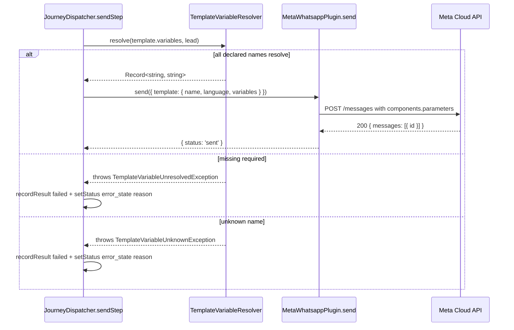

# 048 — Template Variable Resolution Design

**Spec:** `.specs/features/048-template-variable-resolution/spec.md`
**Status:** Draft

---

## Architecture Overview

A single new pure service + a focused dispatcher edit + a Meta plugin
update. No schema change. No new aggregate.



---

## Components

### `TemplateVariableResolver`

- **Purpose:** Pure mapper from declared variable names + Lead context →
  `Record<string, string>`. Throws on missing/unknown so the dispatcher
  can short-circuit cleanly.
- **Location:** `apps/api/src/modules/engine/core/services/template-variable-resolver.ts`.
- **Interface:** `resolve(variables: readonly string[], context: { lead: LeadVariableContext }): Record<string, string>`.
- **`LeadVariableContext`:** `{ name: string; phone: string | null; ownerExternalId: string | null }` — the subset of Lead fields the dispatcher already has on `LockedJourney`.
- **Declared mappings (closed):**
  - `leadFirstName` → first whitespace-delimited token of `name`.
  - `leadName` → full `name`.
  - `leadPhone` → `phone` (throws if null).
  - `ownerExternalId` → `ownerExternalId` (throws if null).
- **Reuses:** Nothing. Stateless, no DI deps.

### `LeadJourneyErrorReason` additions

```typescript
export const LeadJourneyErrorReason = {
  NoChannel: 'no_channel',
  TemplateRequired: 'template_required',
  OwnerNotMapped: 'owner_not_mapped',
  OwnerLookupFailed: 'owner_lookup_failed',
  TemplateVariableMissing: 'template_variable_missing',
  TemplateVariableUnknown: 'template_variable_unknown',
} as const
```

### Template-variable exceptions

`apps/api/src/modules/engine/core/errors/template-variable.errors.ts`
exports `TemplateVariableUnresolvedException` and
`TemplateVariableUnknownException`. Both carry the variable name. Engine-
internal exceptions (the dispatcher catches both; they don't reach HTTP).

### `JourneyDispatcher.sendStep` — focused edit

Inside `sendStep` (before `plugin.send`):

```typescript
let resolvedVariables: Record<string, string> | undefined
if (template) {
  try {
    resolvedVariables = this.variableResolver.resolve(template.variables, {
      lead: {
        name: journey.leadName ?? '',
        phone: journey.leadPhone,
        ownerExternalId: journey.leadOwnerExternalId,
      },
    })
  } catch (error) {
    const reason = error instanceof TemplateVariableUnknownException
      ? LeadJourneyErrorReason.TemplateVariableUnknown
      : LeadJourneyErrorReason.TemplateVariableMissing
    await this.touchAttempts.recordResult(tx, attempt.id, {
      status: 'failed',
      error: `${reason}:${error.variableName}`,
    })
    return await this.errorOut(tx, journey.id, reason)
  }
}
```

The `template` value comes from `step.templateId` → repo lookup (already in
the existing code). `LockedJourney` needs `leadName` added to its projection
(currently has `leadExternalId` + `leadPhone` + `leadOwnerExternalId` but
not the lead's display `name`). Trivial repo extension.

### `MetaWhatsappPlugin.send` — variables → components mapping

When `payload.template.variables` is present:

```typescript
const parameters = Object.values(payload.template.variables).map((text) => ({
  type: 'text' as const,
  text,
}))
const components = parameters.length === 0
  ? undefined
  : [{ type: 'body', parameters }]
```

Order of `parameters` follows the iteration order of `Object.values`, which
preserves insertion order on a Record. Since the dispatcher passes the
variables in the order they were declared on the template, the positional
order matches Meta's `{{1}}`/`{{2}}` expectations.

### `LeadJourneyRepository.lockById` — add `leadName` to projection

`LockedJourney` gains `leadName: string`. The `lockById` SELECT projection
adds `leadName: leads.name`. Backward-compatible (no existing reader breaks).

---

## Data Models

No schema change. No new table, no new column. Only the const-object
addition (compile-time only) and `LockedJourney`'s projection widening.

---

## Error Handling Strategy

| Scenario | Handling | User Impact |
| --- | --- | --- |
| Template declares a variable the resolver doesn't know | `TemplateVariableUnknownException` → `error_state` reason `template_variable_unknown` | Admin reviews the template, fixes variable names, or asks for resolver extension (Phase 2.1+) |
| Template declares `leadPhone` but the lead has `phone: null` | `TemplateVariableUnresolvedException` → `error_state` reason `template_variable_missing` | Admin fixes the Pipedrive deal (adds the phone) and re-triggers, or removes the variable from the template |
| Variable resolves to empty string after trimming (e.g. `leadFirstName` from a name like `"   "`) | Same as missing — `TemplateVariableUnresolvedException` | Same as above |
| Template declares `variables: []` (no variables) | Resolver returns `{}`; dispatcher passes `template: { name, language }` without `variables` (current behavior preserved) | Invisible |

---

## Tech Decisions

| Decision | Choice | Rationale |
| --- | --- | --- |
| Where does the resolver live? | `modules/engine/core/services/` | The dispatcher is its only caller; lives next to the dispatcher's other services. Future template-rendering for other plugins reuses the same resolver. |
| Closed-vocabulary variable names or open? | **Closed.** Only `leadFirstName`/`leadName`/`leadPhone`/`ownerExternalId` are accepted initially. | Limits foot-guns; templates explicitly request a known field, no implicit "I'll resolve whatever name you give me". Custom fields ship later as a separate slice. |
| Where do exception classes live? | `modules/engine/core/errors/template-variable.errors.ts` | Engine-internal; dispatcher catches both; never surfaces to HTTP. |
| Should the resolver be DI-injected with a registry of mappers? | No — single pure function with a lookup map | YAGNI for now. Refactor when a second plugin needs different mappers. |
| First-token-of-name extraction edge case | Resolver returns the first whitespace-delimited token; throws if the result is empty after trim | Matches the realistic "personalized first name" use case for BDR cadences; orgs-as-lead-name (Pipedrive default for deals) still yields a usable token |
| Schema change? | None | The `templates.variables` column already exists; runtime resolution doesn't require persisted lead context beyond what's already there |
