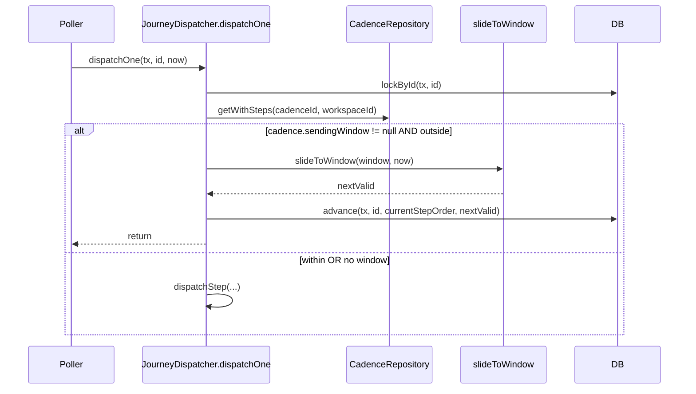

# 049 — Cadence Sending Window Design

**Spec:** `.specs/features/049-cadence-sending-window/spec.md`
**Status:** Draft

---

## Architecture Overview

Three additions and one focused dispatcher edit:

1. **`SendingWindow` domain type** + a pure `slideToWindow(window, after): Date` helper that uses `Intl.DateTimeFormat` for TZ-aware day-of-week + minute-of-day extraction. No external date library — Bun's Intl support is native.

2. **`cadences.sendingWindow` jsonb nullable column**. Empty/null = always-on. Migration `0011`.

3. **Contract update**: `CadenceSchema` gains an optional `sendingWindow` field validated by zod; the API rejects invalid shapes with `422 cadence.invalid-sending-window`.

4. **Dispatcher edit**: `dispatchOne` (after lockById, before dispatchStep) checks the window; if outside, calls `journeys.advance(tx, id, currentStepOrder, nextValid)` and returns without sending. No `error_state` transition — the journey just slides.



---

## Components

### `SendingWindow` (interface)

```typescript
export interface SendingWindow {
  timezone: string             // IANA, e.g. 'America/Sao_Paulo'
  days: readonly number[]      // day-of-week, 0=Sun..6=Sat, non-empty subset
  startMinute: number          // minute-of-day, 0..1440 exclusive, < endMinute
  endMinute: number            // minute-of-day, > startMinute, <= 1440
}
```

- **Location:** `apps/api/src/modules/cadence/core/domain/sending-window.ts`.

### `slideToWindow(window, after): Date`

- **Purpose:** Pure function returning the earliest `Date` >= `after` that falls within the window. Uses `Intl.DateTimeFormat` with the window's TZ to extract day-of-week + minute-of-day; loops at most 7 days.
- **Location:** `apps/api/src/modules/cadence/core/domain/sending-window-slide.ts`.
- **Interface:** `slideToWindow(window: SendingWindow, after: Date): Date`.
- **Throws:** Nothing. If `after` is already inside the window, returns `after` unchanged.
- **Reuses:** Native `Intl.DateTimeFormat`. No date-fns.

### `isWithinWindow(window, when): boolean`

- **Purpose:** Cheaper dispatcher-side guard before calling `slideToWindow`.
- **Location:** same file.
- **Interface:** `isWithinWindow(window: SendingWindow, when: Date): boolean`.

### Cadence aggregate update

- **Schema:** `cadences.sendingWindow: jsonb` nullable, `$type<SendingWindow>()`.
- **Contract:** `SendingWindowSchema` (zod, top-level v4) added to `@kizunu/api-contracts/cadence`. Validations:
  - `timezone`: non-empty string; runtime check via `Intl.DateTimeFormat.supportedLocalesOf` style — actually use `try { new Intl.DateTimeFormat('en', { timeZone: tz }); return true } catch { return false }` in a `.refine`.
  - `days`: `z.array(z.number().int().min(0).max(6)).min(1).max(7)`.
  - `startMinute` / `endMinute`: `z.number().int().min(0).max(1440)`.
  - `.refine`: `startMinute < endMinute`.
- **Use case:** Existing `CreateCadenceUseCase` / `UpdateCadenceUseCase` accept the new field; validation runs at the contract layer.
- **Cadence repository:** `getWithSteps` projection adds `sendingWindow`; insert/update pass it through.

### Dispatcher edit

Inside `JourneyDispatcher.dispatchOne`:

```typescript
if (cadence.sendingWindow && !isWithinWindow(cadence.sendingWindow, now)) {
  const nextValid = slideToWindow(cadence.sendingWindow, now)
  await this.journeys.advance(tx, journey.id, journey.currentStepOrder, nextValid)
  return
}
```

Placed **after** `resolveNextStep` (so we still exit early on exhausted) and **before** `dispatchStep`. Uses the existing `advance` repo method which writes only `currentStepOrder + nextTouchAt` — leaves `status='running'` so the next poller tick will re-pick it.

### Cadence repository projection

`getWithSteps` adds `sendingWindow: cadences.sendingWindow`. The
`CadenceWithSteps` type widens accordingly.

---

## Data Models

### Schema delta

```sql
ALTER TABLE cadences ADD COLUMN sending_window jsonb;
```

Nullable, no default. Existing rows read `null`.

### Migration `0011`

Single new migration via `bun db:generate`.

---

## Error Handling Strategy

| Scenario | Handling | User Impact |
| --- | --- | --- |
| `now` is outside the window | `slideToWindow` returns a future `Date`; `advance` writes it; journey stays `running` | Touch fires at the next valid slot; no error |
| Invalid TZ on create | `422 cadence.invalid-sending-window` | Admin fixes the cadence form |
| `startMinute >= endMinute` on create | `422 cadence.invalid-sending-window` | Same |
| Empty `days` array on create | `422 cadence.invalid-sending-window` | Same |
| All days disallowed AND `slideToWindow` hits 7-day cap | Throws `Error('No valid sending window day')` (defensive; zod prevents empty days, so this path is unreachable) | Admin sees a `500` if it ever happens — by construction it can't |

---

## Tech Decisions

| Decision | Choice | Rationale |
| --- | --- | --- |
| Date library? | **None — native `Intl.DateTimeFormat`** | Bun supports Intl natively; date-fns-tz adds a dependency for one helper. Pure functions stay test-friendly. |
| Cross-midnight windows? | **Rejected at validation** | Out of scope for v0.1; admin can split into two cadences if needed. |
| Per-step vs per-cadence window? | **Per-cadence** | Cadence-level is the realistic pilot grain; per-step is Phase 2.1+. |
| When the window opens NOW vs. waiting until startMinute? | **If `now < startMinute` today AND today is allowed → slide to today's startMinute** | Most-immediate dispatch on a valid day; no "round to next day" surprise. |
| Status after slide? | **stay `running`** | No state-machine event; the journey is still valid, just deferred. The poller re-picks at the new `nextTouchAt`. |
| Where the pure functions live? | `modules/cadence/core/domain/` | Cadence owns the vocabulary; dispatcher imports the helpers. |
