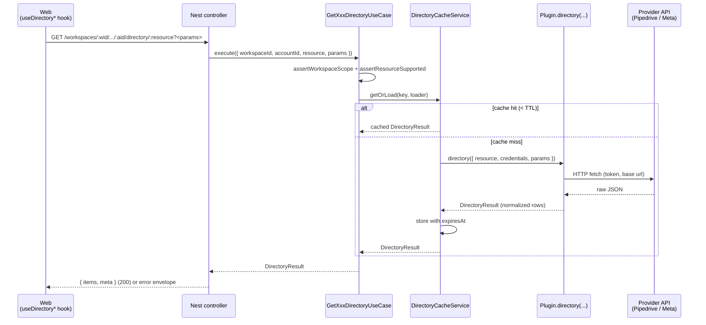

# 054 — Connector Lookups Design

**Spec**: `.specs/features/054-connector-lookups/spec.md`
**Status**: Draft

---

## Architecture Overview

A single per-module use case (`GetConnectorDirectoryUseCase` on CRM,
`GetChannelDirectoryUseCase` on channel) fronts a per-process
`DirectoryCacheService`. The cache wraps a call into the registered plugin's
new optional `directory(input)` method. The web reads the response via a
typed TanStack Query hook family. There is **no new persistence** — every
response is derived live from the provider, then memoized in-process for 60
seconds.



**Workspace scope** is enforced at three layers:
1. The route already carries `:workspaceId` (matches the existing
   convention; see `packages/api-contracts/src/routes/index.ts`).
2. The use case verifies the account belongs to that workspace via the
   existing `findByIdInWorkspace` repository methods → 404 on mismatch.
3. The cache key includes `workspaceId` so two workspaces holding accounts
   with overlapping external IDs (e.g. two Pipedrive subscriptions with the
   same company domain) cannot bleed into each other.

---

## Code Reuse Analysis

### Existing components to leverage

| Component | Location | How to use |
| --- | --- | --- |
| `ConnectorAccountRepository.findByIdInWorkspace` | `apps/api/src/modules/crm/persistence/connector-account.repository.ts` | Resolve `(workspaceId, accountId)` → row; returns null for cross-workspace IDs. |
| `ChannelAccountRepository.findWorkspaceAndCredentials` | `apps/api/src/modules/channel/persistence/channel-account.repository.ts` | Same role for the channel side; already used by `MetaWebhookController`. |
| `CrmConnectorRegistry` | `apps/api/src/modules/crm/core/connector/crm-connector-registry.ts` | `get(connectorId)` returns the plugin; throws `UnknownCrmConnectorException` we already render. |
| `ChannelPluginRegistry` | `apps/api/src/modules/channel/core/plugin/channel-plugin-registry.ts` | Mirror of the CRM registry for channel plugins. |
| `PipedriveApi` | `apps/api/src/modules/crm/plugins/pipedrive/pipedrive-api.ts` | Extend with `listUsers`, `listPipelines`, `listStages(pipelineId)`, `listDealFields`. Reuse `request(...)` + `pipedriveResponseSchema`. |
| `pipedriveCredentialsSchema` | `apps/api/src/modules/crm/plugins/pipedrive/pipedrive-credentials.ts` | Narrow opaque credentials at the plugin boundary, same as `fetchLead`. |
| Meta channel plugin | `apps/api/src/modules/channel/plugins/meta-whatsapp/` | Add `listTemplates`, `listPhoneNumbers` siblings to the existing send/parse-inbound code. |
| `ApplicationException` + filter | `packages/nestjs-shared/src/lib/exceptions/application.exception.ts`, `apps/api/src/modules/identity/http/filters/application-exception.filter.ts` | New error codes plug in unchanged. |
| `createZodDto` + `ZodValidationPipe` | `packages/nestjs-shared` and `apps/api` boot wiring | Standard contract-to-DTO bridge; no new infra. |
| `LookupSelect` / `Combobox` primitives | `apps/web/src/components/composed/lookup-select.tsx`, `apps/web/src/components/primitives/combobox/` | UI; existing API already accepts `{ options, value, onChange, isPending, error, placeholder }`. |
| `EmptyState` | `apps/web/src/components/composed/empty-state.tsx` | Renders inside the lookup when the list is empty or the connector needs reconnecting. |
| `getApiErrorMessage` + `ApiError` | `apps/web/src/lib/get-api-error-message.ts`, `@kizunu/api-client` | The hook's `error → display string` mapper, with `error.code === 'connector.token-expired'` carrying a typed `needsReconnect` flag. |
| TanStack Query keys table | `packages/api-client/src/query-keys.ts` | New `QueryKeys.directory` entry; composes per-resource list keys. |

### Integration points

| System | Integration method |
| --- | --- |
| Existing `meta-coex` flow | The connect-meta-coex screen consumes `useDirectoryMetaPhoneNumbers(channelAccountId)` once the postMessage delivers `waba_id`. The use case is **shared with future cadence-step usage** — no Coex-specific endpoint. |
| Existing `member-connector-identity` admin | Replaces the bare `<Input>` for `externalId` with `useDirectoryPipedriveUsers(connectorAccountId)`. |
| Existing entry-trigger config | Two new Comboboxes wired into the existing form. |
| OAuth refresh service | Untouched — directory failures with token-expired surface as recoverable UI errors, but actual refresh remains owned by `OAuthRefreshService` running on its cron. |

### Concerns acknowledged

There is no `.specs/codebase/CONCERNS.md` entry for the directory layer
(this feature creates it). Two debts this feature *deliberately defers*,
to be filed in `CONCERNS.md` as part of this work:

- In-memory cache only — a second API replica will not share entries.
  Acceptable at the pilot scale; revisit when we add a second pod.
- No provider-side filter — long custom-field directories rely on
  client-side filtering. Above ~1000 entries the modal open will feel
  slow; not a v0.1 problem.

---

## Components

### `DirectoryResult` (shared type)

- **Purpose**: Uniform shape both plugins return; controller serializes it to the response body.
- **Location**: `apps/api/src/modules/_shared/directory/directory-result.ts` (new directory under modules — mirrors the cross-module location of `nestjs-shared`).
- **Interfaces**:
  ```ts
  interface DirectoryRow {
    value: string             // the external ID submitted by the form
    label: string             // human-readable label rendered in the combobox
    sublabel?: string         // optional secondary line (status, language, e.164)
    disabled?: boolean        // for deleted/inactive items still shown for context
  }
  interface DirectoryResult {
    items: readonly DirectoryRow[]
    meta: { truncated: boolean }
  }
  ```
- **Dependencies**: None.
- **Reuses**: Mirrors the simple `value/label` shape already used by `LookupSelect`.

### `DirectoryCacheService`

- **Purpose**: Per-process memoizer keyed by `(workspaceId, accountId, resource, paramsHash)`; lazy eviction.
- **Location**: `apps/api/src/modules/_shared/directory/directory-cache.service.ts`.
- **Interfaces**:
  ```ts
  getOrLoad(
    key: DirectoryCacheKey,
    loader: () => Promise<DirectoryResult>,
    ttlMs: number,
  ): Promise<DirectoryResult>
  invalidate(predicate: (key: DirectoryCacheKey) => boolean): void
  ```
- **Dependencies**: None (pure `Map` + `Date.now()`).
- **Reuses**: Same dependency-free style as `OAuthRefreshService.tick`.
- **Notes**: `paramsHash` is a deterministic JSON stringify of the params object, key sort included; an empty params yields `""`. Workspace isolation is structural (the key carries the workspaceId), not just a contract — even a programming bug elsewhere cannot serve the wrong workspace.

### Plugin contract additions

- **`CRMConnector.directory?(input: DirectoryInput): Promise<DirectoryResult>`**
  in `apps/api/src/modules/crm/core/connector/crm-connector.ts`.
- **`ChannelPlugin.directory?(input: DirectoryInput): Promise<DirectoryResult>`**
  in `apps/api/src/modules/channel/core/plugin/channel-plugin.ts`.
- Shared `DirectoryInput`:
  ```ts
  interface DirectoryInput {
    resource: string
    credentials: unknown
    params?: Readonly<Record<string, string>>
  }
  ```
- Manifest additions (both):
  ```ts
  directoryResources?: readonly DirectoryResourceDescriptor[]
  ```
  Each descriptor: `{ name: 'users' | 'pipelines' | ..., ttlMs?: number, paramsSchema?: ZodSchema }`.
  The use case validates `params` against `paramsSchema` before calling the plugin.

### `GetConnectorDirectoryUseCase` (CRM)

- **Purpose**: Resolve account → registry → cache → plugin for CRM directories.
- **Location**: `apps/api/src/modules/crm/core/use-cases/get-connector-directory.use-case.ts`.
- **Interfaces**:
  ```ts
  execute(input: {
    workspaceId: string
    accountId: string
    resource: string
    params?: Record<string, string>
  }): Promise<DirectoryResult>
  ```
- **Dependencies**: `CrmConnectorRegistry`, `ConnectorAccountRepository`, `DirectoryCacheService`.
- **Reuses**: Same shape as `CreateConnectorAccountUseCase` — assert + execute, no transactions.

### `GetChannelDirectoryUseCase`

- **Purpose**: Channel-side mirror of the above.
- **Location**: `apps/api/src/modules/channel/core/use-cases/get-channel-directory.use-case.ts`.
- **Dependencies**: `ChannelPluginRegistry`, `ChannelAccountRepository`, `DirectoryCacheService`.

### Controllers

- **`ConnectorAccountController.getDirectory`** at `apps/api/src/modules/crm/http/controllers/connector-account.controller.ts` (extend existing controller):
  - `GET /workspaces/:workspaceId/connector-accounts/:accountId/directory/:resource`
  - Query schema validated via `createZodDto(GetConnectorDirectoryRequestSchema)`.
- **`ChannelAccountController.getDirectory`** at `apps/api/src/modules/channel/http/controllers/channel-account.controller.ts`:
  - `GET /workspaces/:workspaceId/channel-accounts/:accountId/directory/:resource`.

Both controllers stay behind `WorkspaceAdminGuard` (already attached to their siblings).

### Pipedrive plugin extensions

- **Location**: `apps/api/src/modules/crm/plugins/pipedrive/pipedrive.connector.ts` + `pipedrive-api.ts`.
- **New methods on `PipedriveApi`** (each reuses the existing `request(...)` helper and returns normalized rows):
  - `listUsers(credentials)` → `GET /users?start=0&limit=500`
  - `listPipelines(credentials)` → `GET /pipelines`
  - `listStages(credentials, pipelineId)` → `GET /stages?pipeline_id=<id>` (sort by `order_nr`)
  - `listDealFields(credentials)` → `GET /dealFields?start=0&limit=500`
- **New on `PipedriveConnector`**:
  - `manifest.directoryResources = [{ name: 'users' }, { name: 'pipelines' }, { name: 'stages', paramsSchema: z.object({ pipelineId: z.string() }).strict() }, { name: 'fields' }]`
  - `async directory({ resource, credentials, params })` switches on `resource` and dispatches to the right `listXxx`.
- **Mapping**: provider 401 → throw `ConnectorTokenExpiredException(accountId)`; 429 → `ConnectorRateLimitedException({ retryAfterSeconds })`; any other non-2xx → wrap existing `CrmRequestFailedException` and let it map to 502 via a controller-side handler.

### Meta channel plugin extensions

- **Location**: `apps/api/src/modules/channel/plugins/meta-whatsapp/`.
- **New methods on the existing `MetaCloudApi` helper** (or equivalent — match the file naming used by `send`/`parseInbound`):
  - `listTemplates(credentials)` → `GET /v22.0/{waba_id}/message_templates?status=APPROVED&limit=200` (paginate up to 500).
  - `listPhoneNumbers(credentials)` → `GET /v22.0/{waba_id}/phone_numbers?limit=200`.
- **Manifest**: `directoryResources = [{ name: 'templates', ttlMs: 30_000 }, { name: 'phoneNumbers' }]` — templates have a shorter TTL because Meta approves/pauses asynchronously and we don't want to keep a paused template visible for a full minute.
- **Mapping**: same exception ladder as Pipedrive.

### New exceptions

| Class | Code | HTTP | Context |
| --- | --- | --- | --- |
| `ConnectorDirectoryUnsupportedException` | `connector.directory-unsupported` | 422 | `{ connectorId, resource }` |
| `ConnectorTokenExpiredException` | `connector.token-expired` | 422 | `{ accountId, scope: 'crm' \| 'channel' }` |
| `ConnectorRateLimitedException` | `connector.rate-limited` | 503 | `{ accountId, retryAfterSeconds?: number }` |
| `ConnectorDirectoryFailedException` | `connector.directory-failed` | 502 | `{ accountId, resource }` |
| `ConnectorDirectoryParamsInvalidException` | `connector.directory-params-invalid` | 422 | `{ resource, issues }` |

Lives at: `apps/api/src/modules/_shared/directory/directory.errors.ts` so both modules import the same set.

### Contract package

Files (all new) under `packages/api-contracts/src/`:

- `crm/get-connector-directory.contract.ts`
  - `DirectoryRowSchema`, `DirectoryResultSchema` (shared)
  - `GetConnectorDirectoryRequestSchema` (query: optional `pipelineId`, etc.)
  - `GetConnectorDirectoryResponseSchema` = `DirectoryResultSchema`
- `channel/get-channel-directory.contract.ts` — same shape, naming under the channel namespace.
- `shared/directory.contract.ts` — the `DirectoryRowSchema` + `DirectoryResultSchema` so both ends import from one place.
- `routes/index.ts` additions:
  ```ts
  connectorAccounts: {
    ...,
    directory: (workspaceId, accountId, resource) =>
      `/workspaces/${workspaceId}/connector-accounts/${accountId}/directory/${resource}`,
  },
  channelAccounts: {
    ...,
    directory: (workspaceId, accountId, resource) =>
      `/workspaces/${workspaceId}/channel-accounts/${accountId}/directory/${resource}`,
  },
  ```

### API client + hooks

Files (all new) under `packages/api-client/src/`:

- `crm/get-connector-directory.api.ts` — pure fetch via `get<T>`.
- `crm/use-directory-pipedrive-users.ts`
- `crm/use-directory-pipedrive-pipelines.ts`
- `crm/use-directory-pipedrive-stages.ts` — `enabled: !!pipelineId`.
- `crm/use-directory-pipedrive-fields.ts`
- `channel/get-channel-directory.api.ts`
- `channel/use-directory-meta-templates.ts`
- `channel/use-directory-meta-phone-numbers.ts`
- `directory/use-directory.ts` — internal helper `useDirectory(scope, accountId, resource, params)` that the typed hooks compose; centralizes the error-mapping logic (turn `code === 'connector.token-expired'` into `error.needsReconnect = true`).
- `query-keys.ts` — add `QueryKeys.directory = 'directory'` and the per-resource key composers.

### Web — composed pieces

Files (all new or extended) under `apps/web/src/`:

- `components/composed/reconnect-connector-empty-state.tsx`
  - Props: `{ accountId, scope: 'crm' | 'channel', onReconnect?: () => void }`
  - Renders `<EmptyState>` with copy + a `Reconnect` button that routes to the connector's settings page (route resolved by the parent — keeps the primitive route-agnostic).
- `routes/_app/settings/connectors/member-identities/-components/member-identity-form.tsx` — switch the `externalId` input from `<RhfField>` to a `<Controller>`-wrapped `LookupSelect` fed by `useDirectoryPipedriveUsers`.
- `routes/_app/settings/cadences/.../-components/entry-trigger-form.tsx` — add the cascading pipeline/stage Comboboxes; clear `stageId` when `pipelineId` changes (via `form.watch` + `useEffect` or RHF's `subscribe`).
- `routes/_app/workspace/connect-meta-coex/-components/connect-meta-coex.tsx` — once `wabaId` is captured, mount a `LookupSelect` for phone numbers; pre-select the postMessage's `phone_number_id`; surface the mismatch warning when the postMessage value isn't on the WABA's roster.
- Cadence step editor — switch the WhatsApp template input to a `LookupSelect` fed by `useDirectoryMetaTemplates`; bind both `name` and `language` from the selected template.

### Data models

**No new tables or migrations.** The feature is pure pass-through with
ephemeral cache state. All persistence already exists: `connector_accounts`
and `channel_accounts` hold the encrypted credentials the use cases load.

---

## Error handling strategy

| Error scenario | Handling | User impact |
| --- | --- | --- |
| Account not found / wrong workspace | Repo returns null → controller `404 ConnectorAccountNotFoundException` (existing). | Generic "not found" — never leak cross-workspace info. |
| Resource unsupported by plugin | `ConnectorDirectoryUnsupportedException` (422). | Should never reach UI in practice (resources are typed); shown as a generic toast if it does. |
| Params invalid (e.g. missing `pipelineId` on stages) | `ConnectorDirectoryParamsInvalidException` (422). | Field-level error on the dependent picker; usually impossible thanks to `enabled: !!pipelineId`. |
| Provider 401 / token expired | Plugin throws `ConnectorTokenExpiredException` (422 with `code: 'connector.token-expired'`). | Lookup renders `ReconnectConnectorEmptyState`. |
| Provider 429 / rate-limited | `ConnectorRateLimitedException` (503) with `retryAfterSeconds` if present. | Lookup empty state: "Provider is rate-limiting us — try again in N seconds." |
| Provider 5xx / network error | Plugin wraps in `ConnectorDirectoryFailedException` (502). | Lookup empty state: "Could not load — Retry"; manual refresh re-fires the query. |
| Truncation | Result `meta.truncated: true`. | Combobox shows "First 500 — search to narrow." |

---

## Tech decisions (non-obvious)

| Decision | Choice | Rationale |
| --- | --- | --- |
| Endpoint shape | Split per scope under existing module roots | Matches the existing `connector-accounts` / `channel-accounts` routes; avoids a cross-module polymorphic controller. The web hook family is the natural place for the polymorphism. |
| Cache layer | In-process `Map`, 60s default TTL | Pilot scale; one API pod. Filed in CONCERNS as a future Redis upgrade. |
| Cache key includes workspaceId | Defense-in-depth | Even if controller scoping is bypassed in a future regression, the cache cannot serve cross-workspace data. |
| Templates TTL = 30s (vs 60s default) | Per-resource override | Meta approves / pauses templates asynchronously; a 1-minute stale list could hide a same-day approval. |
| Server-side filter for Meta templates only | `status=APPROVED` at Meta's API | Pipedrive lists are short enough to filter client-side; Meta templates can be hundreds. |
| Hook family vs single hook | One hook per resource | Better TypeScript signatures (no generic discriminator the consumer has to narrow); each hook gets a meaningful name in the diff. |
| `directory` as optional method | Optional, like `fetchOwner` and `refreshCredentials` | Mirrors the existing optional-port pattern; controller's 422 path renders the right error if a future plugin omits it. |
| Reconnect button is route-agnostic | Parent supplies the `to` | Lets the same primitive serve both `/settings/connectors/...` and `/settings/channels/...` without hardcoding. |
| Pipedrive pagination | `start=0&limit=500` single page | Pipedrive's max page size; >500 users / fields is enterprise-tier and out of v0.1. `meta.truncated` surfaces it if it ever happens. |

---

## Test plan

Drives `generate-tests` invocations during Execute. Fat/thin split per
`TESTING.md` and `.agents/rules/test.md`.

### Fat — focused unit tests

| Component | What gets tested | Test file |
| --- | --- | --- |
| `DirectoryCacheService` | Key derivation determinism, params-order independence, TTL boundary (hit at `expiresAt-1`, miss at `expiresAt`), workspace isolation (two keys differing only in `workspaceId` are distinct), `invalidate(predicate)` removes only matches. | `apps/api/src/modules/_shared/directory/__test__/unit/directory-cache.service.spec.ts` |
| `PipedriveApi.listUsers` / `listPipelines` / `listStages` / `listDealFields` | Successful parse → normalized rows; 401 → `ConnectorTokenExpiredException`; 429 → rate-limited with `retryAfterSeconds`; non-2xx → wrapped failure. Each method's URL + query params. | `apps/api/src/modules/crm/plugins/pipedrive/__test__/unit/pipedrive-api-directory.spec.ts` |
| `PipedriveConnector.directory` | Resource dispatch; unsupported resource throws `ConnectorDirectoryUnsupportedException`; param-schema validation rejects missing `pipelineId` for `stages`. | `apps/api/src/modules/crm/plugins/pipedrive/__test__/unit/pipedrive-connector-directory.spec.ts` |
| Meta plugin `listTemplates` / `listPhoneNumbers` | Same matrix as Pipedrive; templates assertion that `status=APPROVED` is sent on the query string. | `apps/api/src/modules/channel/plugins/meta-whatsapp/__test__/unit/meta-directory.spec.ts` |
| `GetConnectorDirectoryUseCase` / `GetChannelDirectoryUseCase` | Workspace-mismatch → 404 (no plugin call); unsupported resource → 422 (no plugin call); cache hit short-circuits plugin; params hashed deterministically into the cache key. | Two unit specs colocated with the use case. |
| Web error mapping | `useDirectory` underlying helper sets `error.needsReconnect = true` when the response carries `code: 'connector.token-expired'`; other codes leave it false. | `packages/api-client/src/directory/__test__/unit/use-directory.spec.ts` |

### Thin — covered by e2e

| Slice | What gets exercised | Test file |
| --- | --- | --- |
| `GET /workspaces/:wid/connector-accounts/:aid/directory/users` | Happy path with a seeded Pipedrive account + faked fetch on the registry; one workspace-scoping case (404). | `apps/api/src/__test__/e2e/connector-directory.spec.ts` |
| `GET /workspaces/:wid/channel-accounts/:aid/directory/templates` | Happy path + token-expired path returning the typed error envelope. | `apps/api/src/__test__/e2e/channel-directory.spec.ts` |

The plugins' `fetchFn` is injected in both e2e specs (same pattern as
`connect-meta-coex.spec.ts`), so the suite stays hermetic — no real
provider call.

### Web

- The `<Controller>`-wrapped `LookupSelect` blocks are mostly orchestration; coverage falls out of the existing form e2e flows once the picker swaps in. Add one focused unit spec on the cascading-clear behavior of the entry-trigger form (`useEffect` on `pipelineId` clears `stageId`). One web unit spec for `ReconnectConnectorEmptyState`'s copy + action wiring.

---

## Requirement traceability

| Req ID | Components / files | Phase | Status |
| --- | --- | --- | --- |
| LOOKUP-01 | Pipedrive `directory` resource `users`, `useDirectoryPipedriveUsers`, member-identity-form swap | Tasks | Pending |
| LOOKUP-02 | `DirectoryCacheService.getOrLoad` TTL/hit logic | Tasks | Pending |
| LOOKUP-03 | Web hook exposes `refetch`; lookup wires a refresh button | Tasks | Pending |
| LOOKUP-04 | `ConnectorTokenExpiredException`, `useDirectory` mapping, `ReconnectConnectorEmptyState` | Tasks | Pending |
| LOOKUP-05 | `ConnectorAccountRepository.findByIdInWorkspace` precheck in use case | Tasks | Pending |
| LOOKUP-06 | Pipedrive `pipelines` + `stages` resources; entry-trigger form pickers | Tasks | Pending |
| LOOKUP-07 | Entry-trigger form `useEffect` clearing `stageId` on `pipelineId` change | Tasks | Pending |
| LOOKUP-08 | Empty-pipelines branch in entry-trigger form (renders `EmptyState` with link) | Tasks | Pending |
| LOOKUP-09 | Pipedrive `fields` resource; variable resolver form | Tasks | Pending |
| LOOKUP-10 | Combobox client-side filter (already supported by primitive) | Tasks | Pending |
| LOOKUP-11 | Stored-but-deleted field rendered as `{ disabled: true, label: '<key> (deleted)' }` row appended client-side | Tasks | Pending |
| LOOKUP-12 | Meta `templates` resource; cadence-step picker | Tasks | Pending |
| LOOKUP-13 | Template selection populates `language` form field | Tasks | Pending |
| LOOKUP-14 | Zero-approved-templates branch in cadence-step form | Tasks | Pending |
| LOOKUP-15 | Meta channel `ConnectorTokenExpiredException` mapping (shared exception class) | Tasks | Pending |
| LOOKUP-16 | Meta `phoneNumbers` resource; Coex confirmation picker | Tasks | Pending |
| LOOKUP-17 | Roster-mismatch branch in connect-meta-coex component | Tasks | Pending |
| LOOKUP-18 | Empty-roster branch in connect-meta-coex component (Finish disabled) | Tasks | Pending |
| LOOKUP-19 | `directory` method added as optional on both plugin interfaces; controller falls back to 422 | Tasks | Pending |
| LOOKUP-20 | `manifest.directoryResources` declaration on both plugins; use case validates resource membership pre-call | Tasks | Pending |
| LOOKUP-21 | Cache key composer includes `workspaceId` | Tasks | Pending |
| LOOKUP-22 | `ConnectorRateLimitedException` + `retryAfterSeconds` parsing | Tasks | Pending |
| LOOKUP-23 | `meta.truncated` plumbed through Pipedrive `listX` slice helpers + response schema | Tasks | Pending |
| LOOKUP-24 | Web hook documents the recommended invalidation hook on reconnect mutations (no code change in this PR if the reconnect mutation already invalidates the relevant keys; otherwise added there). | Tasks | Pending |

**Coverage:** 24 total → 24 mapped to design components. 0 unmapped. ✅

---

## Sequencing and parallelism notes for Execute

Three independent tracks; the controller/contract layer is the gating
critical-path because both web and provider work depend on its shape.

```
                         ┌─ shared/directory contract  ─┐
[Phase 1, sequential] ── │  cache service + errors      │
                         │  plugin interface additions  │
                         └─ controllers + use cases ────┘
                                          │
            ┌─────────────────────────────┼─────────────────────────────┐
[Phase 2,   │                             │                             │
 parallel] Pipedrive `directory`      Meta `directory`           api-client hooks
            (+ unit tests)             (+ unit tests)             + query keys
            └─────────────────────────────┼─────────────────────────────┘
                                          │
[Phase 3, parallel by surface] ── web swaps (member-identity, entry-trigger,
                                  cadence step, connect-meta-coex)
                                  + ReconnectConnectorEmptyState
                                          │
[Phase 4, single]          ── e2e on both directory endpoints; CONCERNS.md note
```

Phase 2 has three real `[P]` lanes; Phase 3 has four (one per surface)
because the web hooks are typed independently. Tasks document will mark
the parallel-eligible items with `[P]`.

---

## Open items for `Tasks`

These are deliberately deferred to `tasks.md`:

- Exact file path for the `_shared/directory/` module (whether to register
  it as its own NestJS module or attach pieces to crm/channel modules
  directly — leaning standalone).
- Whether to expose the Meta `phoneNumbers` resource pre-Coex-completion
  (it requires the WABA's access token, which we *do* get from the
  exchange step before the channel-account row is persisted). The current
  design assumes the row exists; if pilots need the picker mid-Coex,
  Tasks will need to add a temporary access-token-bearing endpoint variant
  that bypasses `findByIdInWorkspace` while still scoping by workspace.
- The exact LookupSelect API extensions, if any, needed for the
  `meta.truncated` hint banner (might be a parent-rendered note rather
  than a primitive prop).
