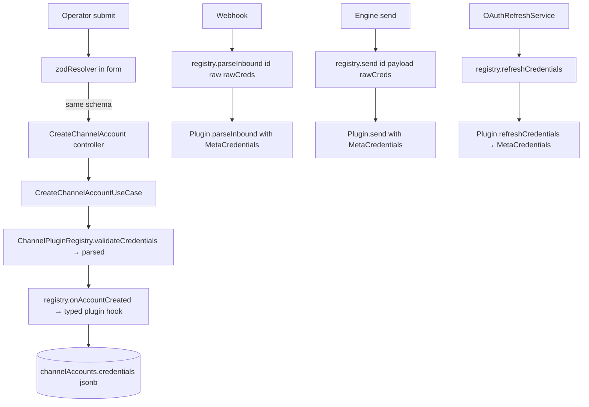

# Channel Credentials Zod Builder — Design

**Spec**: `.specs/features/056-channel-credentials-zod-builder/spec.md`
**Status**: Draft

---

## Architecture Overview

The change has four moving parts, all wired around one principle: **a Zod
schema annotated with `.meta()` is the single source of truth for the
credential surface — types, validation, and form metadata.**

```
                ┌────────────────────────────────────────────┐
                │  @kizunu/api-contracts/shared/credentials  │
                │  - CredentialField, CredentialFields       │
                │  - describeCredentialFields(schema)        │
                │  - PluginCredentialsShapeUnsupported       │
                └─────────────────┬──────────────────────────┘
                                  │ imported by both
                ┌─────────────────┴───────────────────────────┐
                │                                             │
                ▼                                             ▼
   ┌──────────────────────────┐                  ┌──────────────────────────┐
   │ @kizunu/api-contracts/   │                  │ apps/api channel module  │
   │   channel/meta-creds.ts  │ ───imported──▶   │  defineChannelPlugin(spec)│
   │  (z.discriminatedUnion + │     by both      │  ChannelPluginRegistry    │
   │   .meta() annotations)   │                  │   .send/.directory/...    │
   └──────────────┬───────────┘                  └──────────────┬───────────┘
                  │ also imported by                            │
                  ▼                                             ▼
   ┌──────────────────────────────┐         ┌─────────────────────────────┐
   │ apps/web channel-account-    │         │ Use-cases call registry      │
   │  form.tsx → zodResolver(    │         │  bridges; plugin methods     │
   │   metaCredentialsClient)    │         │  take typed credentials      │
   └──────────────────────────────┘         └─────────────────────────────┘
```



Net effect: `unknown` lives in exactly two places — the `jsonb` column read by
Drizzle (because it has to) and the registry's raw entry parameter (because
that's the parse seam). Everywhere else is `z.infer<S>`.

### Research findings (Zod v4 introspection)

Verified live (`bun run /tmp/zod-meta-probe.ts`):

- `.meta(obj)` attaches `obj` to a schema; `.meta()` reads it. Carries through
  `.min().meta()` chains. Does **not** propagate through `.optional()` /
  `.default()` wrappers — meta must be applied to the inner schema:
  `z.string().min(1).optional().meta({...})` keeps `.meta()` on the outer
  wrapper. The walker reads the outer first, then unwraps if `meta()` is
  undefined.
- `ZodObject.shape` is a plain object of per-key schemas. `Object.entries(shape)`
  gives `[key, schema]` pairs.
- A field's `_def.type` is a discriminant: `'string'`, `'optional'`, `'default'`,
  `'literal'`. For `optional` / `default`, `_def.innerType` points at the inner
  schema.
- `isOptional()` returns `true` for both `.optional()` and `.default()` — that's
  the `required` flag's source of truth.
- `ZodDiscriminatedUnion._def` carries `discriminator: string` and
  `options: ZodObject[]`. Each option is itself an object whose `shape`
  includes the discriminator literal alongside the per-variant fields.

These observations drive the walker (`describeCredentialFields`) below.

---

## Code Reuse Analysis

### Existing Components to Leverage

| Component | Location | How to Use |
|---|---|---|
| `ChannelPlugin` interface | `apps/api/src/modules/channel/core/plugin/channel-plugin.ts` | Make generic: `ChannelPlugin<S extends ZodTypeAny = ZodTypeAny>`. |
| `ChannelPluginManifest` | `apps/api/src/modules/channel/core/plugin/channel-plugin-manifest.ts` | Make generic; drop `credentialFields` as input; expose it as a derived getter. |
| `ChannelPluginRegistry` | `apps/api/src/modules/channel/core/plugin/channel-plugin-registry.ts` | Add typed-bridge methods (`send`, `parseInbound`, `directory`, `refreshCredentials`, `onAccountCreated`); keep `validateCredentials` for the use-case's create path. |
| `metaCredentialsSchema`, `metaCredentialsClientSchema` | `apps/api/src/modules/channel/plugins/meta-whatsapp/meta-credentials.ts` | Move to `packages/api-contracts/src/channel/meta-credentials.ts`; add `.meta()` annotations. |
| `CreateChannelAccountUseCase` | `apps/api/src/modules/channel/core/use-cases/create-channel-account.use-case.ts` | Switch to `registry.onAccountCreated`; drop the local `enrich` helper. |
| `OAuthRefreshService` | `apps/api/src/modules/channel/core/services/oauth-refresh.service.ts` | Switch to `registry.refreshCredentials`. |
| `GetChannelDirectoryUseCase` | `apps/api/src/modules/channel/core/use-cases/get-channel-directory.use-case.ts` | Switch to `registry.directory`. |
| Meta inbound handler / engine send | `apps/api/src/modules/.../*` | Switch to `registry.parseInbound` / `registry.send`. |
| `ChannelPluginsResponseSchema` + `channel-plugins.contract.ts` | `packages/api-contracts/src/channel/channel-plugins.contract.ts` | Re-export `CredentialField` from shared; keep wire shape identical. |
| `channel-account-form.tsx` | `apps/web/src/routes/_app/settings/channels/-components/channel-account-form.tsx` | Replace per-plugin schema lookup + `hasRequiredCredentials` with a per-plugin `zodResolver`. |
| `userInputFields` util | `apps/web/.../channels/-utils/user-input-fields.ts` | Reused as-is — filters `serverGenerated`. |
| `CredentialFieldsInput` | `apps/web/.../channels/-components/credential-fields-input.tsx` | Reused as-is for now (still flat `text|secret`). Generalization is Feature 057's call. |

### Integration Points

| System | Integration Method |
|---|---|
| Drizzle `channel_accounts.credentials jsonb` | Unchanged. Registry parses on read. |
| `GET /channel-plugins` | Response shape unchanged from the wire (operator-facing flat fields). Server builds it from `describeCredentialFields(...)` instead of the hand-written array. |
| `POST /channel-accounts` (`CreateChannelAccountRequestSchema`) | Contract's `credentials` stays `z.record(z.string(), z.unknown())` at the contract level — the **per-plugin** schema is what the web and the use-case validate against. (Switching the contract to a discriminated union per plugin would force the contracts package to know every plugin's schema, which loses the registry's plugin-pluggability.) |
| `OAuthRefreshService` cron | Calls `registry.refreshCredentials(id, channelAccountId, rawRow.credentials)`. |
| Meta inbound webhook controller | Calls `registry.parseInbound(id, raw, rawCreds)`. |

### `CONCERNS.md` check

`.specs/codebase/CONCERNS.md` does not flag the channel plugin port; no extra
mitigation needed. The riskiest neighbour is `OAuthRefreshService` (touches
production tokens); we preserve its observable behaviour and existing tests.

---

## Components

### 1. `CredentialField` + `CredentialFields` (contracts/shared)

- **Purpose**: One canonical wire-shape for per-field operator input metadata,
  shared by channel and connector ports.
- **Location**: `packages/api-contracts/src/shared/credentials/`
  - `credential-field-kind.ts` — `'text' | 'secret'` today, closed const-object
    + derived type (enums.md §1). Open for future kinds; new kinds require a
    coordinated API + web release (acknowledged in spec Out of Scope).
  - `credential-field.ts`
  - `credential-fields.ts` — the flat / discriminated wrapper
  - `describe-credential-fields.ts`
  - `plugin-credentials-shape-unsupported.exception.ts` — boot-time fail-fast
  - `index.ts`
- **Interfaces**:
  ```ts
  // credential-field-kind.ts
  export const CredentialFieldKind = { Text: 'text', Secret: 'secret' } as const
  export type CredentialFieldKind =
    (typeof CredentialFieldKind)[keyof typeof CredentialFieldKind]

  // credential-field.ts
  export interface CredentialField {
    key: string
    label: string
    kind: CredentialFieldKind
    required: boolean
    serverGenerated?: boolean
  }

  // credential-fields.ts
  export type CredentialFields =
    | { kind: 'flat'; fields: CredentialField[] }
    | { kind: 'discriminated'; key: string; variants: Record<string, CredentialField[]> }

  // describe-credential-fields.ts
  export function describeCredentialFields(schema: ZodTypeAny): CredentialFields
  ```
- **Algorithm** (`describeCredentialFields`):
  1. Unwrap any single layer of `ZodEffects` / `ZodOptional` / `ZodDefault`
     until you reach a base shape; if not `ZodObject` or
     `ZodDiscriminatedUnion`, throw `PluginCredentialsShapeUnsupportedException`.
  2. If `ZodObject`: walk `shape` entries; for each entry, build a
     `CredentialField` from `.meta()` (fall back to key + `text`), and set
     `required = !field.isOptional()`. Skip the discriminator literal key (not
     applicable here). Return `{ kind: 'flat', fields }`.
  3. If `ZodDiscriminatedUnion`: take `_def.discriminator` as `key`, iterate
     `_def.options`. For each option object, find the literal value at
     `shape[key]._def.value`, then walk its remaining fields (excluding the
     discriminator) like the flat case. Return
     `{ kind: 'discriminated', key, variants }`.
- **Dependencies**: zod v4 (already in catalog).
- **Reuses**: const-object + derived-type pattern (enums.md §1) for
  `CredentialFieldKind`.

### 2. `metaCredentialsSchema` + `metaCredentialsClientSchema` (contracts/channel)

- **Purpose**: Single source of truth for Meta credentials, importable by API
  and web.
- **Location**: `packages/api-contracts/src/channel/meta-credentials.ts`
  (delete the API-module copy).
- **Interfaces** (no API change — same shape moved):
  ```ts
  const cloudApiCredentialsSchema = z.object({
    channelMode: z.literal('cloud_api'),
    appId: z.string().min(1).meta({ label: 'Meta App ID', kind: 'text' }),
    appSecret: z.string().min(1).meta({ label: 'Meta App Secret', kind: 'secret' }),
    wabaId: z.string().min(1).meta({ label: 'WABA ID', kind: 'text' }),
    phoneNumberId: z.string().min(1).meta({ label: 'Phone number ID', kind: 'text' }),
    systemToken: z.string().min(1).meta({ label: 'System token', kind: 'secret' }),
    verifyToken: z.string().min(1).meta({
      label: 'Verify token', kind: 'secret', serverGenerated: true,
    }),
  }).strict()

  const coexistenceCredentialsSchema = z.object({
    channelMode: z.literal('coexistence'),
    wabaId: z.string().min(1).meta({ label: 'WABA ID', kind: 'text' }),
    phoneNumberId: z.string().min(1).meta({ label: 'Phone number ID', kind: 'text' }),
    verifyToken: z.string().min(1).meta({
      label: 'Verify token', kind: 'secret', serverGenerated: true,
    }),
    // shared `oauthCredentialFields` mixin — also annotated with .meta() in its source
    ...oauthCredentialFields,
  }).strict()

  export const metaCredentialsSchema = z.discriminatedUnion('channelMode', [
    cloudApiCredentialsSchema, coexistenceCredentialsSchema,
  ])

  export const metaCredentialsClientSchema = cloudApiCredentialsSchema.omit({
    channelMode: true, verifyToken: true,
  })
  ```
- **Dependencies**: `oauthCredentialFields` from `@kizunu/api-contracts/shared`
  (already lives there).
- **Reuses**: existing oauth field mixin; existing schema *shape* (no
  validation behaviour change).

### 3. `defineChannelPlugin` factory + generic `ChannelPlugin<S>`

- **Purpose**: Capture the `S` generic via inference (TS can't infer it from
  `class X implements ChannelPlugin<...>`) so plugin authors write methods with
  fully-inferred `z.infer<S>` parameters.
- **Location**: `apps/api/src/modules/channel/core/plugin/`
  - `channel-plugin.ts` — generic on `S`
  - `channel-plugin-manifest.ts` — generic on `S`; `credentialFields` becomes
    derived (not on the spec input — see `define-channel-plugin.ts`)
  - `define-channel-plugin.ts` — the factory
- **Interfaces**:
  ```ts
  // channel-plugin.ts
  import type { ZodTypeAny, z } from 'zod'
  export interface ChannelPlugin<S extends ZodTypeAny = ZodTypeAny> {
    readonly manifest: ChannelPluginManifest<S>
    send(payload: SendPayload, credentials: z.infer<S>): Promise<SendResult>
    parseInbound(raw: unknown, credentials: z.infer<S>): Promise<InboundMessage[]>
    validate(input: ValidateInput): ChannelDecision
    onAccountCreated?(input: OnAccountCreatedInput<z.infer<S>>): Promise<z.infer<S>>
    refreshCredentials?(input: RefreshCredentialsInput<z.infer<S>>): Promise<z.infer<S>>
    directory?(input: DirectoryInput<z.infer<S>>): Promise<DirectoryResult>
  }

  // channel-plugin-manifest.ts
  export interface ChannelPluginManifest<S extends ZodTypeAny = ZodTypeAny> {
    id: string
    name: string
    capabilities: ChannelCapability[]
    configSchema: S
    /** Derived from configSchema via describeCredentialFields. */
    credentialFields: CredentialFields
    directoryResources?: readonly DirectoryResourceDescriptor[]
  }

  // define-channel-plugin.ts
  export interface ChannelPluginSpec<S extends ZodTypeAny>
    extends Omit<ChannelPlugin<S>, 'manifest'> {
    manifest: Omit<ChannelPluginManifest<S>, 'credentialFields'>
  }

  export function defineChannelPlugin<S extends ZodTypeAny>(
    spec: ChannelPluginSpec<S>,
  ): ChannelPlugin<S> {
    return {
      ...spec,
      manifest: {
        ...spec.manifest,
        credentialFields: describeCredentialFields(spec.manifest.configSchema),
      },
    }
  }
  ```
- **Dependencies**: zod, `describeCredentialFields` from the shared contracts
  package.
- **Reuses**: pattern matches `defineConfig`-style factories elsewhere in the
  ecosystem (Vite, Drizzle); single source of inference.

### 4. `ChannelPluginRegistry` — typed bridges

- **Purpose**: Single seam where `unknown` becomes `z.infer<S>`. Use-cases use
  this; plugins never see raw credentials.
- **Location**: `apps/api/src/modules/channel/core/plugin/channel-plugin-registry.ts`
- **Interfaces**:
  ```ts
  @Injectable()
  export class ChannelPluginRegistry {
    // existing
    has(id: string): boolean
    get(id: string): ChannelPlugin                          // typed as unknown S
    listManifests(): ChannelPluginManifest[]
    validateCredentials(id: string, raw: unknown): unknown  // create-account
                                                            // path; returns parsed
                                                            // (typed via overload
                                                            // if desired, not
                                                            // required)

    // NEW typed bridges
    async send(id: string, payload: SendPayload, raw: unknown): Promise<SendResult>
    async parseInbound(id: string, raw: unknown, rawCreds: unknown): Promise<InboundMessage[]>
    async directory(id: string, input: Omit<DirectoryInput<unknown>, 'credentials'>,
                    rawCreds: unknown): Promise<DirectoryResult>
    async refreshCredentials(id: string, channelAccountId: string,
                             rawCreds: unknown): Promise<unknown>  // returns the new
                                                                    // parsed creds for
                                                                    // persistence
    async onAccountCreated(id: string, input: Omit<OnAccountCreatedInput<unknown>,
                           'credentials'>, validatedCreds: unknown): Promise<unknown>
  }
  ```
- **Implementation pattern** (one shared helper):
  ```ts
  private parse(id: string, raw: unknown): z.infer<ZodTypeAny> {
    const plugin = this.get(id)
    const result = plugin.manifest.configSchema.safeParse(raw)
    if (!result.success) throw new InvalidChannelCredentialsException(id)
    return result.data
  }
  ```
  Every bridge: `const creds = this.parse(id, rawCreds); return plugin.method(..., creds)`.
- **Dependencies**: existing exceptions.
- **Reuses**: existing `InvalidChannelCredentialsException`, `UnknownChannelPluginException`.

### 5. `MetaWhatsappPlugin` — built via `defineChannelPlugin`

- **Purpose**: Adopt the factory, drop the per-method `.parse()` calls, drop
  the hand-written `credentialFields`.
- **Location**: `apps/api/src/modules/channel/plugins/meta-whatsapp/meta-whatsapp.plugin.ts`
- **Interfaces**: same external surface (still exported as a NestJS provider via
  `channel.module.ts`), but its body becomes:
  ```ts
  export function buildMetaWhatsappPlugin(deps: {
    baseUrl?: string; fetchFn?: FetchFn; config?: MetaWhatsappPluginConfig
  }): ChannelPlugin<typeof metaCredentialsSchema> {
    return defineChannelPlugin({
      manifest: {
        id: 'meta-whatsapp',
        name: 'WhatsApp (Meta Cloud API)',
        capabilities: [ChannelCapability.Freeform, ChannelCapability.Template],
        configSchema: metaCredentialsSchema,
        directoryResources: [{ name: 'templates', ttlMs: TEMPLATES_TTL_MS },
                             { name: 'phoneNumbers' }],
      },
      validate(input) { /* unchanged */ },
      async send(payload, credentials) {
        // credentials: MetaCredentials — no .parse() here
        return sendMetaMessage({ payload, credentials, baseUrl, fetchFn })
      },
      async parseInbound(raw, _credentials) { return parseMetaInbound(raw) },
      async directory(input) {
        const ctx = { fetchFn, baseUrl, accountId: input.accountId, credentials: input.credentials }
        if (input.resource === 'templates') return listMetaTemplates(ctx)
        if (input.resource === 'phoneNumbers') return listMetaPhoneNumbers(ctx)
        throw new ConnectorDirectoryUnsupportedException({ ... })
      },
      async refreshCredentials({ credentials }) {
        if (credentials.channelMode !== 'coexistence') return credentials
        const refreshed = await exchangeForRefreshedToken({ ... })
        return { ...credentials, accessToken: refreshed.accessToken,
                 accessTokenExpiresAt: refreshed.accessTokenExpiresAt }
      },
      async onAccountCreated({ credentials, channelAccountId, appUrl }) {
        // credentials is the parsed client/discriminated value — no re-parse.
        // Today's branching is preserved (cloud_api vs coexistence).
        if (credentials.channelMode === 'coexistence') {
          return this.onCoexAccountCreated(appUrl, channelAccountId, credentials)
        }
        return this.onCloudApiAccountCreated(appUrl, channelAccountId, credentials)
      },
    })
  }
  ```
  The NestJS provider exports `buildMetaWhatsappPlugin(...)` from
  `channel.module.ts` so `MetaWhatsappPlugin` (the class) goes away. The two
  helper methods (`onCloudApiAccountCreated`, `onCoexAccountCreated`) move to
  module-scope functions in the same file. `MetaWhatsappPluginConfig` stays as
  a closure capture, not a class field.
- **Dependencies**: shared schema (now from contracts package), existing helpers.

### 6. `OnAccountCreatedInput<T>`, `RefreshCredentialsInput<T>`, `DirectoryInput<T>` — generic versions

- **Purpose**: Type the `credentials` field on each port-input shape so the
  generic plugin port stays coherent.
- **Location**:
  - `apps/api/src/modules/channel/core/plugin/on-account-created-input.ts`
  - `apps/api/src/modules/channel/core/plugin/refresh-credentials-input.ts`
  - `apps/api/src/modules/_shared/directory/directory-input.ts`
- **Change**: `credentials: unknown` → `credentials: T` with `T = unknown`
  default for callers that don't care.

### 7. `channel-account-form.tsx` (web) — `zodResolver` on the per-plugin schema

- **Purpose**: Validate credentials with the same schema as the API; remove
  `hasRequiredCredentials`.
- **Location**: `apps/web/src/routes/_app/settings/channels/-components/channel-account-form.tsx`
- **Approach**:
  - The form continues to register a top-level zod resolver, but per-plugin:
    the resolver is built from `CreateChannelAccountRequestBaseSchema.extend({
    credentials: pluginCredentialsClientSchema })` recomputed on plugin change.
  - To avoid the "resolver captured at mount" pitfall flagged in today's
    comment, follow `react-hook-form`'s documented pattern for dynamic
    resolvers: pass a function resolver that reads the latest schema from a
    ref. `apps/web` already has `zodResolver` from `@hookform/resolvers/zod`;
    we wrap it once.
  - Per-plugin schema lookup uses a small client-side registry
    (`apps/web/.../channels/-utils/plugin-client-schemas.ts`) that maps
    `pluginId` to its imported schema from `@kizunu/api-contracts`. Today: one
    entry (`'meta-whatsapp': metaCredentialsClientSchema`). Feature 057 will
    add the connector client-side analogue at its own location.
  - On submit, `values.credentials` is already typed and parsed by the
    resolver; `hasRequiredCredentials` and the `errors.credentials` runtime
    branch are deleted.
- **Dependencies**: `@hookform/resolvers/zod`, the new
  `metaCredentialsClientSchema` from contracts.
- **Reuses**: `CredentialFieldsInput`, `RhfField`, `FormError`,
  `userInputFields`, `PluginSelect`.

### 8. Use-case wiring updates (call the registry's typed bridges)

- **`CreateChannelAccountUseCase`** —
  `apps/api/src/modules/channel/core/use-cases/create-channel-account.use-case.ts`
  - `validated = registry.validateCredentials(id, input.credentials)` (still
    used — this is the create path's seam).
  - Replace `await this.enrich(plugin, channelAccountId, validated)` with
    `await registry.onAccountCreated(id, { channelAccountId, appUrl }, validated)`.
- **`OAuthRefreshService`** —
  `apps/api/src/modules/channel/core/services/oauth-refresh.service.ts`
  - Replace direct `plugin.refreshCredentials(...)` calls with
    `registry.refreshCredentials(id, channelAccountId, rawCreds)`.
- **`GetChannelDirectoryUseCase`** —
  `apps/api/src/modules/channel/core/use-cases/get-channel-directory.use-case.ts`
  - Replace direct `plugin.directory(...)` with `registry.directory(id, ..., rawCreds)`.
- **Meta inbound webhook handler** — wherever it calls `plugin.parseInbound`
  today, replace with `registry.parseInbound(id, raw, rawCreds)`.
- **Engine send path** — wherever it calls `plugin.send` today, replace with
  `registry.send(id, payload, rawCreds)`.

> The integration tests under
> `apps/api/src/modules/channel/persistence/__test__/integration/` and the
> use-case spec files (`apps/api/src/modules/channel/core/use-cases/__test__/`)
> stay green by behaviour. Their assertions are about the persisted result and
> Meta API call sequence, not about who calls `.parse()`.

---

## Data Models

No DB changes. `channelAccounts.credentials` stays `jsonb`. The TS-level
boundary type for the column read is unchanged (`unknown`) — the registry now
narrows it for downstream code.

---

## Error Handling Strategy

| Error Scenario | Handling | User Impact |
|---|---|---|
| Operator submits an invalid credential field | Web `zodResolver` flags per-field via `errors.credentials.<key>`; server-side `registry.validateCredentials` mirrors the check and returns 422 if reached. | Per-field inline error in the form; same status code as today. |
| Persisted credentials become invalid after a schema tightening | `registry.send`/`directory`/etc. throws `InvalidChannelCredentialsException(id)` → 422. | Same envelope as today. |
| Plugin declared with an unsupported schema shape (e.g. union of unions) | `describeCredentialFields` throws `PluginCredentialsShapeUnsupportedException` at boot when `defineChannelPlugin` runs — Nest fails to start, surfaced in logs. | Fail-fast at deploy; no operator impact. |
| Schema field lacks `.meta()` annotations | Walker emits `label = key`, `kind = 'text'`. Renderable, ugly but functional. | Form shows the raw field key — caught in review, not at runtime. |
| `onAccountCreated` returns invalid credentials | Today: persisted as-is. Now: `registry.onAccountCreated` re-validates the plugin's return against its own schema before returning, so a buggy enrichment hook surfaces as 422 instead of writing a broken row. | New defensive check; tightens current behaviour at no UX cost. |

---

## Tech Decisions

| Decision | Choice | Rationale |
|---|---|---|
| Where to keep `unknown` | At two seams only: the `jsonb` column type (Drizzle inferred) and the registry's raw entry parameter. | Strict hexagonal — port is generic, implementation is typed, persistence is opaque. Matches D2/D3 intent without paying for it. |
| Capture `S` via factory vs class generic | Factory `defineChannelPlugin<S>(spec)`. | TS can't infer `S` from `class X implements ChannelPlugin<...>` declarations; the factory is the standard Zod-inference idiom (see Drizzle's `defineRelations`, Vite's `defineConfig`). |
| Manifest's `credentialFields` derived, not declared | Derived inside `defineChannelPlugin` from the schema. | Eliminates the duplication that motivated this feature. |
| Discriminated vs flat `CredentialFields` wire shape | Manifest stores `CredentialFields` (the discriminated/flat union). `GET /channel-plugins` response keeps today's flat array shape (operator-input fields only — the client-schema projection). | Preserves wire compatibility with the web form's current contract; the discriminated representation is server-side only this feature and gets surfaced to the web when 057's UI generalizes the form. |
| Web client-side per-plugin schema registry | Tiny map in `-utils/plugin-client-schemas.ts`. | Avoids dynamic-import of `@kizunu/api-contracts` paths; the only entry is `meta-whatsapp` today. Feature 057 adds `pipedrive`. |
| `OnAccountCreatedInput<T>` re-validates plugin return | Yes — `registry.onAccountCreated` runs `safeParse` on the plugin's output and throws if invalid. | The plugin's return is going into a `jsonb` column. If we trust the schema as truth, we must enforce it on the way out too. The new check is server-side; observable error envelope unchanged. |
| Closed `CredentialFieldKind` const-object | `{ Text: 'text', Secret: 'secret' }` (today's two kinds). Closed; expansion requires an explicit kind addition + UI work. | Matches enums.md §1 (const-object + derived type) and resists accidental UI gaps when a new kind appears. |
| Failure mode when `.meta()` is missing | Fall back to `label = key`, `kind = 'text'`. Don't throw. | Lets new plugins boot during dev without front-loading metadata; review catches the ugly label before merge. Failing fast here would block experimentation. |
| What happens when `configSchema` is not `ZodObject` / `ZodDiscriminatedUnion` | Throw `PluginCredentialsShapeUnsupportedException` at `defineChannelPlugin` time. | Boot-time failure ⊂ runtime failure; we catch unsupported shapes the moment the plugin is registered. |
| Migrate `MetaWhatsappPlugin` from class to factory output | Replace class with `buildMetaWhatsappPlugin(...)` (factory closure). | The class only exists to hold `baseUrl`/`fetchFn`/`config` fields; a closure does that with less ceremony and removes the `implements ChannelPlugin` declaration that breaks `S` inference. |

---

## Validation against the two-consumer constraint (Feature 057 readiness)

The spec mandates that the shared layer be proven against both a discriminated
union (Meta) and a flat schema (Pipedrive-shaped). The walker's algorithm
(component 1 above) covers both:

- **Flat case (Pipedrive-shaped fixture in walker tests)**: `z.object({...}).strict()`
  → `{ kind: 'flat', fields }`. Required from `isOptional()`. `.meta()` for
  per-field metadata. `apiToken` annotated `kind: 'secret'`, `companyDomain`
  `kind: 'text'`. The test fixture verifies the walker's output matches what
  Pipedrive's current manifest *would* expose if it adopted the shared layer.
- **Discriminated case (Meta — production schema)**: `z.discriminatedUnion(...)`
  → `{ kind: 'discriminated', key: 'channelMode', variants: { cloud_api: [...],
  coexistence: [...] } }`. Each variant strips the discriminator literal and
  reuses the flat walk for its remaining fields.

Feature 057 adopts the shared layer with zero changes — it adds a Pipedrive
schema (annotated) and points its `defineCrmConnector` at the same walker.

---

## Open questions

None at design-time. Every Acceptance Criterion is mapped to a component
above; the walker's behaviour against Pipedrive's shape is provable by unit
test in this feature, not deferred.
