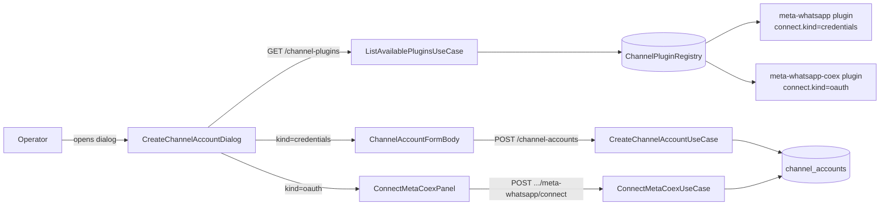

# WhatsApp Coex as a second channel plugin — Design

**Spec**: `.specs/features/058-meta-whatsapp-coex-as-plugin/spec.md`
**Status**: Draft

---

## Architecture Overview

Split the single `meta-whatsapp` plugin registration into two registered
plugins that share runtime modules but differ in onboarding shape:

- `meta-whatsapp` — Cloud API operator-paste credentials (today's flow,
  unchanged on the surface). Stored shape narrowed in this feature to
  the `cloud_api` variant **at the runtime layer** (the contracts package
  keeps its discriminated union to avoid a cascade; the registry still
  parses with the existing schema and the cloud_api plugin's runtime
  works against a stored shape with `channelMode: 'cloud_api'`).
- `meta-whatsapp-coex` — Embedded Signup OAuth. Reuses `meta-send`,
  `meta-inbound`, `meta-directory`, and the existing
  `ConnectMetaCoexUseCase`. Adds a `manifest.connect` descriptor of kind
  `'oauth'` so the web client renders the FB Login panel instead of a
  credentials form.

Two-step backwards compat:

1. A one-shot Drizzle migration flips every row whose
   `credentials->>'channelMode' = 'coexistence'` from
   `pluginId='meta-whatsapp'` to `pluginId='meta-whatsapp-coex'`.
2. Three callers that today assume `pluginId='meta-whatsapp'` for every
   Meta row are corrected to use the row's actual `pluginId` (or to
   accept both ids where the distinction is irrelevant).

The web's New Channel dialog branches inside its existing body on the
typed `connect.kind`. The standalone `/workspace/connect-meta-coex` page
becomes a redirect (P2 story, low-cost) to keep bookmarks working.



---

## Code Reuse Analysis

### Existing components leveraged as-is

| Component | Location | How to use |
| --- | --- | --- |
| `sendMetaMessage` | `apps/api/src/modules/channel/plugins/meta-whatsapp/meta-send.ts` | Imported by both plugins; no change. |
| `parseMetaInbound` | `.../meta-whatsapp/meta-inbound.ts` | Imported by both plugins; no change. |
| `listMetaTemplates` / `listMetaPhoneNumbers` | `.../meta-whatsapp/meta-directory.ts` | Imported by both plugins. |
| `isWithinServiceWindow` | `.../meta-whatsapp/customer-service-window.ts` | Used by both plugins' `validate`. |
| `exchangeForRefreshedToken` | `.../meta-whatsapp/meta-coex-token.ts` | Used only by the Coex plugin's `refreshCredentials`. |
| `finalizeMetaCoexConnection` | `.../meta-whatsapp/meta-whatsapp.plugin.ts` | Stays where it is; `ConnectMetaCoexUseCase` keeps calling it. |
| `ConnectMetaCoexUseCase` | `.../channel/core/use-cases/connect-meta-coex.use-case.ts` | Writes `pluginId='meta-whatsapp-coex'` after this feature instead of `'meta-whatsapp'`. Internal `META_PLUGIN_ID` constant changes to `META_COEX_PLUGIN_ID`. |
| `ChannelPluginRegistry` | `.../channel/core/plugin/channel-plugin-registry.ts` | Unchanged. Naturally supports the second plugin; the duplicate-id guard still applies. |
| `defineChannelPlugin` | `.../channel/core/plugin/define-channel-plugin.ts` | Unchanged; the new `connect` field on the manifest is optional and defaulted by the factory. |
| `useChannelPlugins` (hook) | `packages/api-client/src/channel/use-channel-plugins.ts` | Unchanged behavior; new field on the response is forwarded automatically. |
| `useConnectMetaCoex` (hook) | `packages/api-client/src/channel/use-connect-meta-coex.ts` | Reused unchanged from inside the dialog OAuth panel. |
| `useMutationDialog` | `apps/web/src/lib/use-mutation-dialog.ts` | The OAuth panel wraps its mutation with this helper, same as every CRUD dialog. |
| `ConnectMetaCoex` (component) | `apps/web/src/routes/_app/workspace/connect-meta-coex/-components/connect-meta-coex.tsx` | Either reused as-is from inside the dialog, or split into a thin `ConnectMetaCoexPanel` that drops the page-level `<h1>` and standalone "Channel name" header so it fits inside `ResourceDialog`. |

### Integration points

| System | Integration method |
| --- | --- |
| `channelAccounts.pluginId` column (varchar 100) | One-shot Drizzle migration flips coexistence rows. Schema unchanged — the column already accepts any string. |
| `channel-plugins.contract.ts` response shape | Extend `ChannelPluginsResponseSchema.plugins[].` with `connect: { kind: 'credentials' } | { kind: 'oauth', provider: 'meta-coex' }`. New required field, but it's additive and the API can ship the new field before the web reads it. |
| `connect-meta-coex.contract.ts` response shape | Update `pluginId: z.literal('meta-whatsapp-coex')`. Breaking change to that response, but the only consumer is the in-app dialog flow we control. |
| `MetaWebhookController.receive` | Switches the parseInbound call to use the row's actual `pluginId` instead of the hard-coded `META_PLUGIN_ID`. (Critical: after migration the hard-coded constant would route Coex rows through the wrong plugin's schema.) |
| `template-form.tsx` channel filter | Accepts both `meta-whatsapp` and `meta-whatsapp-coex` as "Meta accounts" via a shared `META_PLUGIN_IDS` helper. |
| `seed.ts` `CHANNEL_PLUGIN_ID` | Out of scope to seed Coex rows; constant stays. Optionally add a sibling constant once Coex seeding is wanted (deferred). |

If `.specs/codebase/CONCERNS.md` flags any of these areas, the design's
explicit caller fix-up addresses them: this feature ships with a `git
grep "'meta-whatsapp'"` sweep so no Coex-row caller is missed.

---

## Components

### `ChannelPluginManifest` extension

- **Purpose**: Carry the typed `connect` descriptor that drives web
  branching.
- **Location**: `apps/api/src/modules/channel/core/plugin/channel-plugin-manifest.ts`
- **Interfaces**:
  - Add `connect?: ChannelPluginConnect` to the existing interface.
  - New file `apps/api/src/modules/channel/core/plugin/channel-plugin-connect.ts`:
    ```typescript
    export const ChannelPluginConnectKind = {
      Credentials: 'credentials',
      Oauth: 'oauth',
    } as const
    export type ChannelPluginConnectKind =
      (typeof ChannelPluginConnectKind)[keyof typeof ChannelPluginConnectKind]

    export const OauthProvider = { MetaCoex: 'meta-coex' } as const
    export type OauthProvider = (typeof OauthProvider)[keyof typeof OauthProvider]

    export type ChannelPluginConnect =
      | { kind: typeof ChannelPluginConnectKind.Credentials }
      | { kind: typeof ChannelPluginConnectKind.Oauth; provider: OauthProvider }
    ```
    (Enum-as-const-object per `.agents/rules/enums.md` §1.)
- **Dependencies**: none.
- **Reuses**: enum pattern from `verification-token.ts`,
  `journey-event.ts`.

`defineChannelPlugin` defaults the field: if a manifest omits `connect`
it's filled as `{ kind: 'credentials' }`. This keeps the change additive
for the Cloud API plugin and any future "boring" plugin (Pipedrive,
Telegram bot tokens) without churning their manifests.

### `meta-whatsapp-coex` plugin builder

- **Purpose**: Register the Coex flow as a real `ChannelPlugin`.
- **Location**: new file
  `apps/api/src/modules/channel/plugins/meta-whatsapp-coex/meta-whatsapp-coex.plugin.ts`
  (sibling folder to `meta-whatsapp/`).
- **Interfaces**:
  - `buildMetaWhatsappCoexPlugin(options?: { baseUrl?; fetchFn?; config?: { appId; appSecret } }): ChannelPlugin<S, never>`
    where `S` is the **coexistence-only** Zod schema (a new export
    from `@kizunu/api-contracts/channel/meta-credentials.contract`,
    `metaCoexistenceCredentialsSchema`, which is just the existing
    discriminated variant lifted as a standalone object schema).
  - Manifest:
    - `id: 'meta-whatsapp-coex'`
    - `name: 'WhatsApp (Coex / Embedded Signup)'`
    - `capabilities: [Freeform, Template]` (same as Cloud API).
    - `configSchema: metaCoexistenceCredentialsSchema`
    - `inputSchema`: **omitted** — the create-account form path is not
      used; `inputSchema` defaults to `configSchema` only to satisfy the
      manifest contract.
    - `directoryResources: [{ name: 'templates', ttlMs }, { name: 'phoneNumbers' }]`
    - `connect: { kind: 'oauth', provider: 'meta-coex' }`.
  - Methods:
    - `send` → delegates to `sendMetaMessage`.
    - `parseInbound` → delegates to `parseMetaInbound`.
    - `validate` → same `isWithinServiceWindow` logic as Cloud API.
    - `directory` → same dispatch as Cloud API.
    - `refreshCredentials` → calls `exchangeForRefreshedToken` (always
      runs because the configSchema is coexistence-only — no
      discriminator branch).
    - `onAccountCreated` → **not defined**. The OAuth flow doesn't go
      through the create-account path; the registry's
      `validateCredentials` is only used to parse stored rows.
- **Dependencies**: same `meta-send`, `meta-inbound`, `meta-directory`,
  `meta-coex-token`, `customer-service-window` modules. Imports them
  directly from the sibling `meta-whatsapp/` folder. **The
  `defineChannelPlugin` factory must allow `onAccountCreated` to be
  optional** (it already is per `channel-plugin.ts:41`).
- **Reuses**: every Cloud API runtime helper. The only new code is the
  builder + the manifest.

### `meta-whatsapp` plugin builder (modified)

- **Purpose**: stays Cloud API-only at the runtime layer once migration
  flips the Coex rows away.
- **Location**: `apps/api/src/modules/channel/plugins/meta-whatsapp/meta-whatsapp.plugin.ts`
- **Changes**:
  - Manifest gets explicit `connect: { kind: 'credentials' }` (or relies
    on the factory default — designer chooses the explicit form for
    documentation clarity).
  - `refreshCredentials` keeps its `if (credentials.channelMode !== 'coexistence') return credentials`
    guard for safety, but in practice never fires once the migration
    runs. This is the safety belt the spec leaves intact (spec out of
    scope explicitly says "do not narrow the contracts schema in this
    feature").
  - `finalizeMetaCoexConnection` and `CoexConnectionInput` **move** from
    this file to `apps/api/src/modules/channel/plugins/meta-whatsapp-coex/`
    (call it `meta-coex-finalize.ts`) so the Coex plugin module owns its
    own onboarding helper. `ConnectMetaCoexUseCase` updates its import.
    Reason: the Cloud API plugin should not export Coex helpers.
- **Reuses**: existing structure.

### `ListAvailablePluginsUseCase` (modified)

- **Purpose**: include the `connect` descriptor in the response.
- **Location**: `apps/api/src/modules/channel/core/use-cases/list-available-plugins.use-case.ts`
- **Changes**: drop the hard `throw` for discriminated manifests when the
  plugin is OAuth (Coex's `credentialFields` array is empty — no
  operator-facing fields). Actually simpler: keep the existing flat
  invariant for credentials-shaped plugins, and for OAuth plugins just
  pass `credentialFields: []`. The boot-time assertion in
  `defineChannelPlugin` already enforces the flat shape for the
  credentials path; for OAuth we **bypass** the input-fields walker
  because there are no operator inputs.

  Approach: in `defineChannelPlugin`, only assert flatness when
  `spec.manifest.connect?.kind !== 'oauth'`. The OAuth plugin's
  `credentialFields` is set to an empty array. The use case then maps
  manifest → `{ id, name, capabilities, connect, credentialFields }` and
  the response carries both shapes.
- **Interfaces**: `AvailablePlugin` interface gains `connect: ChannelPluginConnect`.

### `ChannelPluginsResponseSchema` (modified)

- **Purpose**: carry the typed `connect` descriptor over the wire.
- **Location**: `packages/api-contracts/src/channel/channel-plugins.contract.ts`
- **Interfaces**:
  ```typescript
  export const ChannelPluginConnectSchema = z.discriminatedUnion('kind', [
    z.object({ kind: z.literal('credentials') }),
    z.object({ kind: z.literal('oauth'), provider: z.literal('meta-coex') }),
  ])
  export const ChannelPluginsResponseSchema = z.object({
    plugins: z.array(
      z.object({
        id: z.string(),
        name: z.string(),
        capabilities: z.array(z.enum(['freeform', 'template', 'media'])),
        credentialFields: z.array(ChannelCredentialFieldSchema),
        connect: ChannelPluginConnectSchema,
      }),
    ),
  })
  ```
- **Reuses**: zod v4 top-level formats (already used in the file).

### `ConnectMetaCoexUseCase` (modified)

- **Purpose**: write `pluginId='meta-whatsapp-coex'` on the row instead
  of `'meta-whatsapp'`, and update its output.
- **Location**: `apps/api/src/modules/channel/core/use-cases/connect-meta-coex.use-case.ts`
- **Changes**:
  - Rename `META_PLUGIN_ID = 'meta-whatsapp'` → `META_COEX_PLUGIN_ID = 'meta-whatsapp-coex'`.
  - `execute` writes the new `pluginId`.
  - Output type: `pluginId: 'meta-whatsapp-coex'`, `channelMode: 'coexistence'`.
  - Import `finalizeMetaCoexConnection` from its new home in the
    `meta-whatsapp-coex/` folder.
- **Reuses**: existing flow body unchanged.

### `connect-meta-coex.contract.ts` (modified)

- **Purpose**: align the response literal with the new pluginId.
- **Changes**: `pluginId: z.literal('meta-whatsapp-coex')`. Bump the
  response schema's literal; the route URL stays
  `/workspaces/:workspaceId/channel-accounts/meta-whatsapp/connect`
  (renaming the URL is out of scope and would break the existing web
  hook needlessly).

### `MetaWebhookController.receive` (modified)

- **Purpose**: dispatch parseInbound by the row's actual `pluginId`.
- **Location**: `apps/api/src/modules/engine/http/controllers/meta-webhook.controller.ts`
- **Changes**:
  - `findWorkspaceAndCredentials` already returns the row, but only
    fields `workspaceId` + `credentials`. **Repository change required**:
    extend the returned shape to include `pluginId` (or fetch the row
    more completely). Decision: extend the existing method's return
    shape to `{ workspaceId, pluginId, credentials }`. Single caller, one
    line in the repository method.
  - Replace `parseInbound(META_PLUGIN_ID, …)` with
    `parseInbound(account.pluginId, …)`.
  - Remove the `META_PLUGIN_ID` constant from this file.
- **Reuses**: registry's dispatch-by-id; the new Coex plugin's
  `parseInbound` delegates to the same `parseMetaInbound`.

### Web: `ChannelAccountForm` and dialog branching (modified)

- **Purpose**: branch on `plugin.connect.kind` so the dialog body
  swaps between credentials form and OAuth panel.
- **Location**:
  - `apps/web/src/routes/_app/settings/channels/-components/channel-account-form.tsx`
  - `apps/web/src/routes/_app/settings/channels/-dialogs/create-channel-account-dialog.tsx`
- **Changes** (form):
  - Resolve the selected plugin manifest from
    `useChannelPlugins().data?.plugins.find(p => p.id === pluginId)`.
  - When `manifest.connect.kind === 'credentials'` → render the
    existing `ChannelAccountFormBody` (unchanged).
  - When `manifest.connect.kind === 'oauth'` → render the new
    `ConnectMetaCoexPanel` (see below). Pass it the workspaceId and an
    `onSuccess` that closes the dialog the same way the credentials path
    does.
  - The dialog footer's standard "Add channel account" submit button
    only makes sense for the credentials path. When OAuth is selected,
    the dialog must hide that footer button and let the OAuth panel's
    own "Connect" / "Finish connect" buttons drive the action.
  - Mechanism: extend `ChannelAccountForm` to additionally return / emit
    a "submit mode" so the dialog wrapper can decide whether to render
    the standard `actionLabel` footer or not. Simplest implementation:
    the dialog already passes `formId` + `actionLabel`; if the picked
    plugin is OAuth, the form renders an internal panel with its own
    buttons and the dialog's `<ResourceDialog>` is told (via a new
    boolean prop `hideAction`) to render only the Cancel button.
  - Alternative: render two distinct dialog wrappers and split the
    picker outside the dialog. Rejected — it duplicates the picker UX
    and breaks the per-feature folder rule's single-dialog idiom.
- **Changes** (dialog): accept a `hideAction` boolean that the form
  toggles when an OAuth plugin is selected.

### Web: `ConnectMetaCoexPanel` (new)

- **Purpose**: dialog-friendly variant of the existing
  `ConnectMetaCoex` component.
- **Location**:
  `apps/web/src/routes/_app/settings/channels/-components/connect-meta-coex-panel.tsx`
- **Interfaces**:
  - Props: `{ workspaceId: string; onSuccess: () => void; onError: (msg: string) => void; isPending: boolean; setPending: (v: boolean) => void }`
    (or simpler: takes the `useMutationDialog` callbacks).
  - Internals: lifted from the existing `ConnectMetaCoex` component,
    minus the page-level `<h1>`, with the buttons styled to match
    `ResourceDialog`'s footer area. Reuses `useConnectMetaCoex`.
- **Dependencies**: same FB SDK loader, postMessage listener, and
  status surface as today.
- **Reuses**: virtually all of `ConnectMetaCoex` — split it into a
  shared `useEmbeddedSignup` hook + two thin renderers (one for the
  standalone page, one for the dialog), OR keep two near-identical
  components if the JSX divergence is small. Decision deferred to
  implementation (whichever keeps component files ≤50 lines per
  `react.md` §9).
- **Configuration discovery**: reads `VITE_META_APP_ID` and
  `VITE_META_COEX_CONFIG_ID` from `import.meta.env` exactly as the
  existing page does. When either is empty, the panel renders a
  disabled state with the "not configured" copy from spec edge case
  COEX-15 and does not load the FB SDK.

### Web: `/workspace/connect-meta-coex` redirect (P2)

- **Purpose**: avoid 404s on bookmarked URLs.
- **Location**: `apps/web/src/routes/_app/workspace/connect-meta-coex/index.tsx`
- **Changes**: replace the page with a `beforeLoad` that throws
  `redirect({ to: '/_app/settings/channels', search: { addCoex: 1 } })`,
  per `web-patterns.md` §1.5. The settings page reads `addCoex` from
  the search params and, when `1`, auto-opens the dialog with Coex
  preselected.
- **Reuses**: TanStack Router redirect pattern from
  `routes/auth/index.tsx`.

### Web: `template-form.tsx` channel filter (modified)

- **Purpose**: keep Meta accounts (both ids) eligible for templates.
- **Location**: `apps/web/src/routes/_app/workspace/cadences/-components/template-form.tsx`
- **Changes**:
  - Define a shared constant in
    `packages/api-contracts/src/channel/meta-plugin-ids.ts`:
    ```typescript
    export const MetaPluginId = {
      Cloud: 'meta-whatsapp',
      Coex: 'meta-whatsapp-coex',
    } as const
    export type MetaPluginId = (typeof MetaPluginId)[keyof typeof MetaPluginId]
    export const META_PLUGIN_IDS: readonly string[] = [
      MetaPluginId.Cloud,
      MetaPluginId.Coex,
    ]
    export function isMetaPluginId(id: string): boolean {
      return id === MetaPluginId.Cloud || id === MetaPluginId.Coex
    }
    ```
  - Update both `template-form.tsx` lookups (filter + the
    `channelPluginId === 'meta-whatsapp'` branches) to use
    `isMetaPluginId(...)`.
- **Reuses**: enum-as-const-object pattern per `.agents/rules/enums.md`
  §1.

### Migration: `channel_accounts.pluginId` flip

- **Purpose**: flip stored Coex rows to the new plugin id.
- **Location**: generated under `apps/api/drizzle/` by `bun db:generate`
  after the schema source adds a one-shot migration. Schema doesn't
  actually change — this is a **data migration**, not a schema
  migration.
- **Approach**: add a custom migration file via Drizzle's `custom`
  migration support. The SQL:
  ```sql
  UPDATE channel_accounts
    SET plugin_id = 'meta-whatsapp-coex'
    WHERE plugin_id = 'meta-whatsapp'
      AND credentials->>'channelMode' = 'coexistence';
  ```
  Idempotent: a re-run is a no-op (the WHERE filter excludes
  already-flipped rows). Survives empty DBs (no rows match, success).
- **Checksum**: regenerated via the existing
  `bun scripts/drizzle-checksums.ts verify` gate. Never hand-edited
  after generation.

---

## Data Models

### `ChannelPluginConnect` (new domain enum, see component above)

Already specified inline above.

### `metaCoexistenceCredentialsSchema` (new export from contracts)

```typescript
// packages/api-contracts/src/channel/meta-credentials.contract.ts (additive export)
export const metaCoexistenceCredentialsSchema = z.object({
  channelMode: z.literal('coexistence'),
  wabaId: z.string().min(1),
  phoneNumberId: z.string().min(1),
  verifyToken: z.string().min(1),
  accessToken: z.string().min(1),
  refreshToken: z.string().min(1).optional(),
  accessTokenExpiresAt: z.iso.datetime().optional(),
})
export type MetaCoexistenceCredentials = z.infer<typeof metaCoexistenceCredentialsSchema>
```

(Exact field set must match the existing `MetaCoexistenceCredentials`
type produced today by the discriminated union in
`metaCredentialsSchema`. Mirror it 1:1; an `Assert<Equal<...>>` from
`@kizunu/nestjs-shared` catches drift at compile time.)

`metaCredentialsSchema` (the discriminated union) is **kept as-is** so
`meta-whatsapp` plugin's stored-shape parsing keeps working unchanged.
Future cleanup (out of scope): narrow `metaCredentialsSchema` to the
cloud-api variant once Coex rows have been migrated and no consumer
references the union shape.

---

## Error Handling Strategy

| Error scenario | Handling | User impact |
| --- | --- | --- |
| Server-side Meta config (`META_APP_ID` / `META_APP_SECRET` / `META_COEX_CONFIG_ID`) missing AND operator submits the OAuth panel | `ConnectMetaCoexUseCase` throws `MetaCoexNotConfiguredException` (HTTP 422 via `ApplicationExceptionFilter`) | Dialog shows the standard `FormError` with the exception's user-facing message. |
| Web env (`VITE_META_APP_ID` / `VITE_META_COEX_CONFIG_ID`) missing | `ConnectMetaCoexPanel` detects empty values pre-flight, renders disabled state with explanatory copy | Operator sees clear instruction, cannot trigger a doomed OAuth flow. |
| FB SDK fails to load (network blocker) | Existing status-line message in the panel | Operator can retry; no toast spam. |
| FB Login user cancels | Existing "Signup cancelled" status | Dialog stays open; operator can re-attempt or switch back to Cloud API. |
| Meta exchange returns error | `ConnectMetaCoexUseCase` raises `MetaConnectFailedException` | `FormError` inside dialog. |
| Per-WABA subscribed_apps call fails | `MetaSubscriptionFailedException` from `finalizeMetaCoexConnection` | `FormError`; row is not persisted. |
| Migration encounters a row with malformed `credentials` JSON | `UPDATE … WHERE credentials->>'channelMode' = 'coexistence'` simply does not match; row is left at `pluginId='meta-whatsapp'` and the runtime registry still routes it via the existing discriminated schema | No operator impact; row stays functional under the old id. |
| Webhook arrives for a Coex row that pre-migration was `'meta-whatsapp'` and post-migration is `'meta-whatsapp-coex'` AND the controller still hard-codes `'meta-whatsapp'` | Bug — caller fix-up in `MetaWebhookController.receive` switches to `account.pluginId`. Without this fix, post-migration webhooks would parse credentials against the discriminated union (works) but inbox dispatch would be wrong. Fix is part of this feature. | Avoided by design. |

---

## Tech Decisions

| Decision | Choice | Rationale |
| --- | --- | --- |
| Manifest extension shape | `connect: { kind: 'credentials' } \| { kind: 'oauth', provider: 'meta-coex' }` (option A in spec.md) | Smallest typed surface that captures the dispatch decision the web needs to make. Reserves room for new OAuth providers via the `provider` literal without speculating on URLs/scopes (option C). Option B (hard-code id in web) was rejected as a layering violation. |
| Where the OAuth helper lives | Move `finalizeMetaCoexConnection` and `CoexConnectionInput` from `meta-whatsapp/meta-whatsapp.plugin.ts` into `meta-whatsapp-coex/meta-coex-finalize.ts` | Cloud API plugin should not export Coex onboarding helpers. Moves the symbol to its actual owner. |
| Stored-row migration strategy | One-shot SQL UPDATE keyed on `credentials->>'channelMode'='coexistence'` | Deterministic, idempotent, no app-runtime branching. Eliminates the `pluginId='meta-whatsapp'` ambiguity at the source. |
| `metaCredentialsSchema` narrowing | Leave discriminated union as-is in this feature | Out of scope per spec. Avoids cascade through Drizzle column types and `Assert<Equal>` guards. Cleanup is a follow-up after a release where any forgotten caller surfaces. |
| Connect endpoint URL | Keep `/.../channel-accounts/meta-whatsapp/connect` | Renaming the URL to `/meta-whatsapp-coex/connect` would require a coordinated web/api change with no operator-facing benefit. The URL is an implementation detail of the existing `useConnectMetaCoex` hook. |
| Dialog footer button visibility | New `hideAction` prop on `ResourceDialog` toggled by the form when an OAuth plugin is selected | Keeps the standard `ResourceDialog` shape (single mutation submit) intact for credentials plugins. OAuth panel renders its own multi-step buttons inside the dialog body. |
| Web env var discovery | Keep `VITE_META_APP_ID` / `VITE_META_COEX_CONFIG_ID` | Out of scope per spec. A `/me/oauth-config/:provider` discovery endpoint can replace these later without changing the manifest contract. |
| `ConnectMetaCoex` component split | Implementation decides between (a) shared `useEmbeddedSignup` hook + two renderers, or (b) two near-identical components | Both keep components ≤50 lines per `react.md` §9. The decision rests on how much JSX actually diverges between the page and dialog versions — pick whichever keeps the diff smallest. |
| Out-of-band callers of `'meta-whatsapp'` literal | Sweep all of them in this feature: `MetaWebhookController`, `template-form.tsx`, `connect-meta-coex.contract.ts`, `ConnectMetaCoexUseCase`. Skip `seed.ts` (stays Cloud API). | One pass = no follow-up bugs. Each call site has a clear right answer (use row's id, or accept both ids via `META_PLUGIN_IDS`). |

---

## Tips

- **Test the migration with a synthetic coexistence row** at integration
  level. The unit/e2e levels won't exercise the JSON-path SQL.
- **Run `git grep "'meta-whatsapp'"`** before opening the PR to confirm
  no stragglers (only the constants in `meta-whatsapp.plugin.ts:74` and
  any test fixtures should remain that literal exactly).
- **Verify the `MetaCoexistenceCredentials` 1:1** with the existing
  discriminated-union variant using `Assert<Equal<...>>` from
  `@kizunu/nestjs-shared` to catch any field drift at compile time.
- **Keep the dialog's existing `useMutationDialog` contract**. The
  OAuth panel hooks into the same `dialog.captureError` / `dialog.close`
  surfaces — no parallel state.
- **The `ResourceDialog` `hideAction` prop** is a small primitive
  change. It deserves a one-liner unit test confirming the action
  button is hidden when set.
